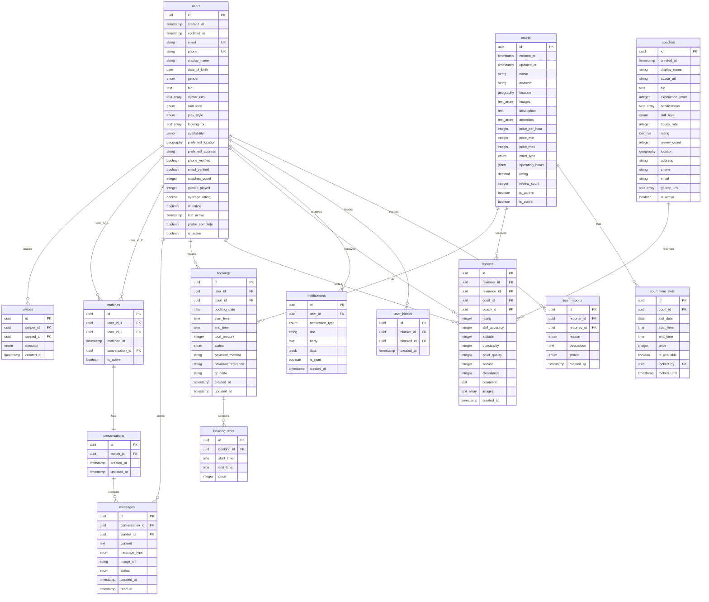

# Database Schema Design - PickleBall Dating App

**Version**: 1.0
**Created**: 2026-01-02
**Database**: PostgreSQL (Supabase)

---

## Table of Contents

1. [Entity-Relationship Diagram](#1-entity-relationship-diagram)
2. [Table Schemas](#2-table-schemas)
3. [Database Design Decisions](#3-database-design-decisions)
4. [Indexing Strategy](#4-indexing-strategy)
5. [Row-Level Security Policies](#5-row-level-security-policies)
6. [Migration Plan](#6-migration-plan)
7. [Frontend Mock Data Mapping](#7-frontend-mock-data-mapping)

---

## 1. Entity-Relationship Diagram



---

## 2. Table Schemas

### 2.1 Table: users

**Purpose**: Store user profiles for players. Core table for authentication and matching.

**Columns**:

| Column | Type | Constraints | Default | Description |
|--------|------|-------------|---------|-------------|
| id | UUID | PRIMARY KEY | gen_random_uuid() | User ID (same as Supabase auth.users.id) |
| created_at | TIMESTAMPTZ | NOT NULL | NOW() | Account creation timestamp |
| updated_at | TIMESTAMPTZ | NOT NULL | NOW() | Last profile update |
| email | VARCHAR(255) | UNIQUE | NULL | User email (from Supabase Auth) |
| phone | VARCHAR(20) | UNIQUE | NULL | Phone number with country code |
| display_name | VARCHAR(100) | NOT NULL | - | Display name |
| date_of_birth | DATE | NOT NULL | - | Date of birth (for age calculation) |
| gender | VARCHAR(20) | NOT NULL, CHECK | - | 'male', 'female', 'other' |
| bio | TEXT | - | NULL | User bio (max 500 chars, validated client-side) |
| avatar_urls | TEXT[] | NOT NULL | '{}' | Array of image URLs (max 6) |
| skill_level | VARCHAR(20) | NOT NULL, CHECK | - | 'beginner', 'intermediate', 'advanced', 'pro' |
| play_style | VARCHAR(20) | NOT NULL, CHECK | - | 'competitive', 'casual', 'social' |
| looking_for | TEXT[] | NOT NULL | '{}' | Array of 'opponent', 'doubles_partner', 'dating' |
| availability | JSONB | - | NULL | Schedule availability {"monday": ["morning", "evening"]} |
| preferred_location | GEOGRAPHY(POINT, 4326) | - | NULL | GPS coordinates (lat, lng) |
| preferred_address | VARCHAR(255) | - | NULL | Human-readable address |
| phone_verified | BOOLEAN | NOT NULL | FALSE | Phone verification status |
| email_verified | BOOLEAN | NOT NULL | FALSE | Email verification status |
| matches_count | INTEGER | NOT NULL | 0 | Total matches count |
| games_played | INTEGER | NOT NULL | 0 | Total games played |
| average_rating | DECIMAL(2,1) | NOT NULL | 0.0 | Average rating (0.0-5.0) |
| is_online | BOOLEAN | NOT NULL | FALSE | Online status |
| last_active | TIMESTAMPTZ | NOT NULL | NOW() | Last activity timestamp |
| profile_complete | BOOLEAN | NOT NULL | FALSE | Profile setup completed |
| is_active | BOOLEAN | NOT NULL | TRUE | Account active status |

**Check Constraints**:
```sql
CONSTRAINT chk_gender CHECK (gender IN ('male', 'female', 'other'))
CONSTRAINT chk_skill_level CHECK (skill_level IN ('beginner', 'intermediate', 'advanced', 'pro'))
CONSTRAINT chk_play_style CHECK (play_style IN ('competitive', 'casual', 'social'))
CONSTRAINT chk_average_rating CHECK (average_rating >= 0 AND average_rating <= 5)
```

**Indexes**:
- `idx_users_location` USING GIST (preferred_location) - Geo-spatial queries
- `idx_users_skill_level` (skill_level) - Matching filter
- `idx_users_is_active` (is_active) WHERE is_active = TRUE - Active users
- `idx_users_last_active` (last_active DESC) - Online status sorting

**Trigger**:
```sql
-- Auto-update updated_at
CREATE TRIGGER set_updated_at
BEFORE UPDATE ON users
FOR EACH ROW
EXECUTE FUNCTION update_updated_at();
```

---

### 2.2 Table: swipes

**Purpose**: Record swipe actions (like/pass) between users.

**Columns**:

| Column | Type | Constraints | Default | Description |
|--------|------|-------------|---------|-------------|
| id | UUID | PRIMARY KEY | gen_random_uuid() | Swipe record ID |
| swiper_id | UUID | REFERENCES users(id) ON DELETE CASCADE | - | User who swiped |
| swiped_id | UUID | REFERENCES users(id) ON DELETE CASCADE | - | User who was swiped |
| direction | VARCHAR(10) | NOT NULL, CHECK | - | 'right' (like) or 'left' (pass) |
| created_at | TIMESTAMPTZ | NOT NULL | NOW() | When swipe occurred |

**Check Constraints**:
```sql
CONSTRAINT chk_direction CHECK (direction IN ('right', 'left'))
CONSTRAINT chk_no_self_swipe CHECK (swiper_id != swiped_id)
```

**Unique Constraint**:
```sql
CONSTRAINT uq_swipe_pair UNIQUE (swiper_id, swiped_id)
```

**Indexes**:
- `idx_swipes_swiper` (swiper_id) - User's swipe history
- `idx_swipes_swiped` (swiped_id) - Who swiped this user
- `idx_swipes_mutual` (swiper_id, swiped_id, direction) WHERE direction = 'right' - Match detection

---

### 2.3 Table: matches

**Purpose**: Store mutual matches between users.

**Columns**:

| Column | Type | Constraints | Default | Description |
|--------|------|-------------|---------|-------------|
| id | UUID | PRIMARY KEY | gen_random_uuid() | Match ID |
| user_id_1 | UUID | REFERENCES users(id) ON DELETE CASCADE | - | First user (lower UUID) |
| user_id_2 | UUID | REFERENCES users(id) ON DELETE CASCADE | - | Second user (higher UUID) |
| matched_at | TIMESTAMPTZ | NOT NULL | NOW() | When match occurred |
| conversation_id | UUID | REFERENCES conversations(id) | - | Associated conversation |
| is_active | BOOLEAN | NOT NULL | TRUE | Match still active (not unmatched) |

**Check Constraint**:
```sql
CONSTRAINT chk_user_order CHECK (user_id_1 < user_id_2)
```

**Unique Constraint**:
```sql
CONSTRAINT uq_match_pair UNIQUE (user_id_1, user_id_2)
```

**Indexes**:
- `idx_matches_user1` (user_id_1) WHERE is_active = TRUE
- `idx_matches_user2` (user_id_2) WHERE is_active = TRUE
- `idx_matches_matched_at` (matched_at DESC) - Recent matches

---

### 2.4 Table: conversations

**Purpose**: Store conversation metadata for matched users.

**Columns**:

| Column | Type | Constraints | Default | Description |
|--------|------|-------------|---------|-------------|
| id | UUID | PRIMARY KEY | gen_random_uuid() | Conversation ID |
| match_id | UUID | REFERENCES matches(id) ON DELETE CASCADE, UNIQUE | - | Associated match |
| created_at | TIMESTAMPTZ | NOT NULL | NOW() | Conversation started |
| updated_at | TIMESTAMPTZ | NOT NULL | NOW() | Last message time |

**Indexes**:
- `idx_conversations_match` (match_id)
- `idx_conversations_updated` (updated_at DESC) - Sort by recent activity

---

### 2.5 Table: messages

**Purpose**: Store chat messages between matched users.

**Columns**:

| Column | Type | Constraints | Default | Description |
|--------|------|-------------|---------|-------------|
| id | UUID | PRIMARY KEY | gen_random_uuid() | Message ID |
| conversation_id | UUID | REFERENCES conversations(id) ON DELETE CASCADE | - | Conversation FK |
| sender_id | UUID | REFERENCES users(id) ON DELETE SET NULL | - | Message sender |
| content | TEXT | - | NULL | Message text content |
| message_type | VARCHAR(10) | NOT NULL, CHECK | 'text' | 'text' or 'image' |
| image_url | VARCHAR(500) | - | NULL | Image URL if type is 'image' |
| status | VARCHAR(15) | NOT NULL, CHECK | 'sent' | 'sending', 'sent', 'delivered', 'read' |
| created_at | TIMESTAMPTZ | NOT NULL | NOW() | Message sent time |
| read_at | TIMESTAMPTZ | - | NULL | When message was read |

**Check Constraints**:
```sql
CONSTRAINT chk_message_type CHECK (message_type IN ('text', 'image'))
CONSTRAINT chk_status CHECK (status IN ('sending', 'sent', 'delivered', 'read'))
CONSTRAINT chk_content_or_image CHECK (
  (message_type = 'text' AND content IS NOT NULL) OR
  (message_type = 'image' AND image_url IS NOT NULL)
)
```

**Indexes**:
- `idx_messages_conversation` (conversation_id, created_at DESC) - Chat history
- `idx_messages_sender` (sender_id) - User's sent messages
- `idx_messages_unread` (conversation_id, status) WHERE status != 'read' - Unread count

---

### 2.6 Table: courts

**Purpose**: Store pickleball court information (managed by admin).

**Columns**:

| Column | Type | Constraints | Default | Description |
|--------|------|-------------|---------|-------------|
| id | UUID | PRIMARY KEY | gen_random_uuid() | Court ID |
| created_at | TIMESTAMPTZ | NOT NULL | NOW() | Record creation |
| updated_at | TIMESTAMPTZ | NOT NULL | NOW() | Last update |
| name | VARCHAR(200) | NOT NULL | - | Court name |
| address | VARCHAR(500) | NOT NULL | - | Full address |
| location | GEOGRAPHY(POINT, 4326) | NOT NULL | - | GPS coordinates |
| images | TEXT[] | NOT NULL | '{}' | Gallery image URLs |
| description | TEXT | - | NULL | Court description |
| amenities | TEXT[] | NOT NULL | '{}' | Amenities list |
| price_per_hour | INTEGER | NOT NULL | - | Base price in VND |
| price_min | INTEGER | - | NULL | Minimum price (time-based) |
| price_max | INTEGER | - | NULL | Maximum price (peak hours) |
| court_type | VARCHAR(10) | NOT NULL, CHECK | - | 'indoor' or 'outdoor' |
| operating_hours | JSONB | NOT NULL | - | {"monday": {"open": "06:00", "close": "22:00"}} |
| rating | DECIMAL(2,1) | NOT NULL | 0.0 | Average rating |
| review_count | INTEGER | NOT NULL | 0 | Total reviews |
| is_partner | BOOLEAN | NOT NULL | FALSE | Partner court badge |
| is_active | BOOLEAN | NOT NULL | TRUE | Court available for booking |

**Check Constraints**:
```sql
CONSTRAINT chk_court_type CHECK (court_type IN ('indoor', 'outdoor'))
CONSTRAINT chk_rating CHECK (rating >= 0 AND rating <= 5)
CONSTRAINT chk_price_range CHECK (price_min IS NULL OR price_max IS NULL OR price_min <= price_max)
```

**Indexes**:
- `idx_courts_location` USING GIST (location) - Geo-spatial search
- `idx_courts_type` (court_type) WHERE is_active = TRUE
- `idx_courts_rating` (rating DESC) - Sort by rating
- `idx_courts_partner` (is_partner) WHERE is_partner = TRUE AND is_active = TRUE

---

### 2.7 Table: court_time_slots

**Purpose**: Manage court availability and slot locking during booking.

**Columns**:

| Column | Type | Constraints | Default | Description |
|--------|------|-------------|---------|-------------|
| id | UUID | PRIMARY KEY | gen_random_uuid() | Slot ID |
| court_id | UUID | REFERENCES courts(id) ON DELETE CASCADE | - | Court FK |
| slot_date | DATE | NOT NULL | - | Date of slot |
| start_time | TIME | NOT NULL | - | Slot start time |
| end_time | TIME | NOT NULL | - | Slot end time |
| price | INTEGER | NOT NULL | - | Price for this slot (VND) |
| is_available | BOOLEAN | NOT NULL | TRUE | Slot available |
| locked_by | UUID | REFERENCES users(id) ON DELETE SET NULL | NULL | User locking slot |
| locked_until | TIMESTAMPTZ | - | NULL | Lock expiry (10 min) |

**Unique Constraint**:
```sql
CONSTRAINT uq_court_slot UNIQUE (court_id, slot_date, start_time)
```

**Indexes**:
- `idx_slots_court_date` (court_id, slot_date) - Availability lookup
- `idx_slots_available` (court_id, slot_date, is_available) WHERE is_available = TRUE
- `idx_slots_locked` (locked_until) WHERE locked_by IS NOT NULL - Cleanup expired locks

---

### 2.8 Table: bookings

**Purpose**: Store court booking records.

**Columns**:

| Column | Type | Constraints | Default | Description |
|--------|------|-------------|---------|-------------|
| id | UUID | PRIMARY KEY | gen_random_uuid() | Booking ID |
| user_id | UUID | REFERENCES users(id) ON DELETE SET NULL | - | Booking user |
| court_id | UUID | REFERENCES courts(id) ON DELETE SET NULL | - | Booked court |
| booking_date | DATE | NOT NULL | - | Date of booking |
| start_time | TIME | NOT NULL | - | Booking start time |
| end_time | TIME | NOT NULL | - | Booking end time |
| total_amount | INTEGER | NOT NULL | - | Total amount in VND |
| status | VARCHAR(15) | NOT NULL, CHECK | 'confirmed' | 'confirmed', 'completed', 'cancelled' |
| payment_method | VARCHAR(20) | NOT NULL | - | 'credit_card', 'momo', 'zalopay', etc. |
| payment_reference | VARCHAR(100) | - | NULL | Payment gateway reference |
| qr_code | TEXT | - | NULL | QR code data for check-in |
| created_at | TIMESTAMPTZ | NOT NULL | NOW() | Booking creation time |
| updated_at | TIMESTAMPTZ | NOT NULL | NOW() | Last update |

**Check Constraints**:
```sql
CONSTRAINT chk_booking_status CHECK (status IN ('confirmed', 'completed', 'cancelled'))
CONSTRAINT chk_booking_time CHECK (start_time < end_time)
```

**Indexes**:
- `idx_bookings_user` (user_id, booking_date DESC) - User's booking history
- `idx_bookings_court` (court_id, booking_date) - Court's bookings
- `idx_bookings_status` (status) WHERE status = 'confirmed' - Upcoming bookings

---

### 2.9 Table: booking_slots

**Purpose**: Store individual time slots within a booking.

**Columns**:

| Column | Type | Constraints | Default | Description |
|--------|------|-------------|---------|-------------|
| id | UUID | PRIMARY KEY | gen_random_uuid() | Slot ID |
| booking_id | UUID | REFERENCES bookings(id) ON DELETE CASCADE | - | Booking FK |
| start_time | TIME | NOT NULL | - | Slot start time |
| end_time | TIME | NOT NULL | - | Slot end time |
| price | INTEGER | NOT NULL | - | Price for this slot (VND) |

**Index**:
- `idx_booking_slots_booking` (booking_id)

---

### 2.10 Table: coaches

**Purpose**: Store coach profiles (managed by admin).

**Columns**:

| Column | Type | Constraints | Default | Description |
|--------|------|-------------|---------|-------------|
| id | UUID | PRIMARY KEY | gen_random_uuid() | Coach ID |
| created_at | TIMESTAMPTZ | NOT NULL | NOW() | Record creation |
| display_name | VARCHAR(100) | NOT NULL | - | Coach name |
| avatar_url | VARCHAR(500) | NOT NULL | - | Profile image |
| bio | TEXT | NOT NULL | - | Coach bio |
| experience_years | INTEGER | NOT NULL | - | Years of experience |
| certifications | TEXT[] | NOT NULL | '{}' | Certification list |
| skill_level | VARCHAR(20) | NOT NULL, CHECK | - | 'advanced' or 'pro' |
| hourly_rate | INTEGER | NOT NULL | - | Rate in VND |
| rating | DECIMAL(2,1) | NOT NULL | 0.0 | Average rating |
| review_count | INTEGER | NOT NULL | 0 | Total reviews |
| location | GEOGRAPHY(POINT, 4326) | - | NULL | GPS coordinates |
| address | VARCHAR(255) | - | NULL | Location address |
| phone | VARCHAR(20) | NOT NULL | - | Contact phone |
| email | VARCHAR(255) | - | NULL | Contact email |
| gallery_urls | TEXT[] | NOT NULL | '{}' | Gallery images |
| is_active | BOOLEAN | NOT NULL | TRUE | Coach available |

**Check Constraints**:
```sql
CONSTRAINT chk_coach_skill CHECK (skill_level IN ('advanced', 'pro'))
CONSTRAINT chk_coach_rating CHECK (rating >= 0 AND rating <= 5)
```

**Indexes**:
- `idx_coaches_location` USING GIST (location) - Geo search
- `idx_coaches_rating` (rating DESC) WHERE is_active = TRUE
- `idx_coaches_active` (is_active) WHERE is_active = TRUE

---

### 2.11 Table: reviews

**Purpose**: Store reviews for users, courts, and coaches.

**Columns**:

| Column | Type | Constraints | Default | Description |
|--------|------|-------------|---------|-------------|
| id | UUID | PRIMARY KEY | gen_random_uuid() | Review ID |
| reviewer_id | UUID | REFERENCES users(id) ON DELETE SET NULL | - | Who wrote the review |
| reviewee_id | UUID | REFERENCES users(id) ON DELETE CASCADE | NULL | Reviewed user (if user review) |
| court_id | UUID | REFERENCES courts(id) ON DELETE CASCADE | NULL | Reviewed court (if court review) |
| coach_id | UUID | REFERENCES coaches(id) ON DELETE CASCADE | NULL | Reviewed coach (if coach review) |
| rating | INTEGER | NOT NULL, CHECK | - | Overall rating 1-5 |
| skill_accuracy | INTEGER | CHECK | NULL | User review: skill accuracy 1-5 |
| attitude | INTEGER | CHECK | NULL | User review: attitude 1-5 |
| punctuality | INTEGER | CHECK | NULL | User review: punctuality 1-5 |
| court_quality | INTEGER | CHECK | NULL | Court review: quality 1-5 |
| service | INTEGER | CHECK | NULL | Court review: service 1-5 |
| cleanliness | INTEGER | CHECK | NULL | Court review: cleanliness 1-5 |
| comment | TEXT | - | NULL | Review text |
| images | TEXT[] | NOT NULL | '{}' | Review images |
| created_at | TIMESTAMPTZ | NOT NULL | NOW() | Review creation |

**Check Constraints**:
```sql
CONSTRAINT chk_rating_range CHECK (rating >= 1 AND rating <= 5)
CONSTRAINT chk_skill_accuracy CHECK (skill_accuracy IS NULL OR (skill_accuracy >= 1 AND skill_accuracy <= 5))
CONSTRAINT chk_attitude CHECK (attitude IS NULL OR (attitude >= 1 AND attitude <= 5))
CONSTRAINT chk_punctuality CHECK (punctuality IS NULL OR (punctuality >= 1 AND punctuality <= 5))
CONSTRAINT chk_court_quality CHECK (court_quality IS NULL OR (court_quality >= 1 AND court_quality <= 5))
CONSTRAINT chk_service CHECK (service IS NULL OR (service >= 1 AND service <= 5))
CONSTRAINT chk_cleanliness CHECK (cleanliness IS NULL OR (cleanliness >= 1 AND cleanliness <= 5))
CONSTRAINT chk_review_target CHECK (
  (reviewee_id IS NOT NULL AND court_id IS NULL AND coach_id IS NULL) OR
  (reviewee_id IS NULL AND court_id IS NOT NULL AND coach_id IS NULL) OR
  (reviewee_id IS NULL AND court_id IS NULL AND coach_id IS NOT NULL)
)
CONSTRAINT chk_no_self_review CHECK (reviewer_id != reviewee_id)
```

**Indexes**:
- `idx_reviews_reviewee` (reviewee_id, created_at DESC) - User reviews
- `idx_reviews_court` (court_id, created_at DESC) - Court reviews
- `idx_reviews_coach` (coach_id, created_at DESC) - Coach reviews
- `idx_reviews_reviewer` (reviewer_id) - Reviews written by user

---

### 2.12 Table: notifications

**Purpose**: Store push notification history.

**Columns**:

| Column | Type | Constraints | Default | Description |
|--------|------|-------------|---------|-------------|
| id | UUID | PRIMARY KEY | gen_random_uuid() | Notification ID |
| user_id | UUID | REFERENCES users(id) ON DELETE CASCADE | - | Recipient user |
| notification_type | VARCHAR(30) | NOT NULL, CHECK | - | Notification type |
| title | VARCHAR(200) | NOT NULL | - | Notification title |
| body | TEXT | NOT NULL | - | Notification body |
| data | JSONB | - | NULL | Additional data (deep link, etc.) |
| is_read | BOOLEAN | NOT NULL | FALSE | Read status |
| created_at | TIMESTAMPTZ | NOT NULL | NOW() | Notification time |

**Check Constraints**:
```sql
CONSTRAINT chk_notification_type CHECK (notification_type IN (
  'new_match', 'new_message', 'booking_confirmed',
  'booking_reminder', 'booking_cancelled', 'promotion'
))
```

**Indexes**:
- `idx_notifications_user` (user_id, created_at DESC) - User's notifications
- `idx_notifications_unread` (user_id, is_read) WHERE is_read = FALSE

---

### 2.13 Table: user_blocks

**Purpose**: Track blocked users.

**Columns**:

| Column | Type | Constraints | Default | Description |
|--------|------|-------------|---------|-------------|
| id | UUID | PRIMARY KEY | gen_random_uuid() | Block ID |
| blocker_id | UUID | REFERENCES users(id) ON DELETE CASCADE | - | User who blocked |
| blocked_id | UUID | REFERENCES users(id) ON DELETE CASCADE | - | Blocked user |
| created_at | TIMESTAMPTZ | NOT NULL | NOW() | When blocked |

**Unique Constraint**:
```sql
CONSTRAINT uq_block UNIQUE (blocker_id, blocked_id)
```

**Check Constraint**:
```sql
CONSTRAINT chk_no_self_block CHECK (blocker_id != blocked_id)
```

**Indexes**:
- `idx_blocks_blocker` (blocker_id) - Users I blocked
- `idx_blocks_blocked` (blocked_id) - Who blocked me

---

### 2.14 Table: user_reports

**Purpose**: Track reported users for moderation.

**Columns**:

| Column | Type | Constraints | Default | Description |
|--------|------|-------------|---------|-------------|
| id | UUID | PRIMARY KEY | gen_random_uuid() | Report ID |
| reporter_id | UUID | REFERENCES users(id) ON DELETE SET NULL | - | User who reported |
| reported_id | UUID | REFERENCES users(id) ON DELETE CASCADE | - | Reported user |
| reason | VARCHAR(30) | NOT NULL, CHECK | - | Report reason |
| description | TEXT | - | NULL | Additional details |
| status | VARCHAR(20) | NOT NULL | 'pending' | 'pending', 'reviewed', 'resolved' |
| created_at | TIMESTAMPTZ | NOT NULL | NOW() | Report time |

**Check Constraints**:
```sql
CONSTRAINT chk_report_reason CHECK (reason IN ('spam', 'fake', 'harassment', 'inappropriate', 'other'))
CONSTRAINT chk_report_status CHECK (status IN ('pending', 'reviewed', 'resolved'))
CONSTRAINT chk_no_self_report CHECK (reporter_id != reported_id)
```

**Indexes**:
- `idx_reports_status` (status) WHERE status = 'pending' - Pending reports
- `idx_reports_reported` (reported_id) - Reports against user

---

## 3. Database Design Decisions

### 3.1 PostgreSQL Features Used

| Feature | Usage | Rationale |
|---------|-------|-----------|
| **UUID** | All primary keys | Distributed-friendly, no sequential guessing |
| **GEOGRAPHY** | Location fields | PostGIS for accurate geo-spatial queries |
| **JSONB** | availability, operating_hours, notification data | Flexible schema for nested objects |
| **TEXT[]** | avatar_urls, amenities, looking_for | Native array support, simpler than junction tables |
| **TIMESTAMPTZ** | All timestamps | Timezone-aware, critical for international users |
| **CHECK constraints** | Enums validation | Data integrity at database level |
| **Partial indexes** | WHERE clauses | Smaller, faster indexes for common queries |

### 3.2 Normalization Decisions

| Table | Decision | Rationale |
|-------|----------|-----------|
| users.avatar_urls | Denormalized (array) | Max 6 images, rarely queried independently |
| courts.amenities | Denormalized (array) | Simple list, no complex queries needed |
| users.availability | Denormalized (JSONB) | Flexible schedule format, frontend-driven structure |
| booking_slots | Normalized | Need to track individual slot prices, support variable pricing |
| messages | Normalized | High volume, need efficient queries |

### 3.3 Data Type Rationale

| Field | Type | Why not alternative? |
|-------|------|---------------------|
| id | UUID | Not SERIAL - distributed-safe, no sequence conflicts |
| avatar_urls | TEXT[] | Not junction table - max 6 items, always fetched together |
| price | INTEGER | Not DECIMAL - VND has no decimals, simpler arithmetic |
| rating | DECIMAL(2,1) | Precision for 1 decimal (4.5), not FLOAT |
| location | GEOGRAPHY | Not GEOMETRY - accounts for Earth's curvature |

### 3.4 Performance Considerations

1. **Swipe Query Optimization**:
   - Pre-filter by location using GIST index
   - Exclude already-swiped users via swipes table
   - Exclude blocked users via user_blocks table

2. **Match Detection**:
   - Use trigger to create match when mutual swipe detected
   - Partial index on swipes WHERE direction = 'right'

3. **Chat Performance**:
   - Compound index (conversation_id, created_at DESC)
   - Paginate with cursor-based pagination

4. **Court Availability**:
   - Generate slots on-demand (not pre-populated)
   - Lock mechanism with 10-minute expiry

---

## 4. Indexing Strategy

### 4.1 Primary Indexes

| Index Name | Table | Columns | Type | Purpose |
|------------|-------|---------|------|---------|
| idx_users_location | users | preferred_location | GIST | Geo-spatial queries for matching |
| idx_users_skill_level | users | skill_level | BTREE | Filter by skill in discovery |
| idx_swipes_mutual | swipes | swiper_id, swiped_id, direction | BTREE | Mutual swipe detection |
| idx_matches_users | matches | user_id_1, user_id_2 | BTREE | User's matches lookup |
| idx_messages_conversation | messages | conversation_id, created_at DESC | BTREE | Chat history pagination |
| idx_courts_location | courts | location | GIST | Nearby courts search |
| idx_bookings_user | bookings | user_id, booking_date DESC | BTREE | Booking history |

### 4.2 Partial Indexes (Optimized for common queries)

| Index Name | Table | Columns | Condition | Purpose |
|------------|-------|---------|-----------|---------|
| idx_users_active | users | id | WHERE is_active = TRUE AND profile_complete = TRUE | Active users only |
| idx_matches_active | matches | user_id_1, user_id_2 | WHERE is_active = TRUE | Active matches only |
| idx_slots_available | court_time_slots | court_id, slot_date | WHERE is_available = TRUE | Available slots only |
| idx_bookings_upcoming | bookings | user_id | WHERE status = 'confirmed' | Upcoming bookings |
| idx_notifications_unread | notifications | user_id | WHERE is_read = FALSE | Unread notifications |

### 4.3 Index Maintenance

```sql
-- Reindex during low-traffic hours (2-4 AM)
REINDEX INDEX CONCURRENTLY idx_messages_conversation;

-- Analyze table statistics weekly
ANALYZE users, swipes, matches, messages, courts, bookings;
```

---

## 5. Row-Level Security Policies

### 5.1 Users Table

```sql
-- Users can read their own profile fully
CREATE POLICY "Users can view own profile"
ON users FOR SELECT
USING (auth.uid() = id);

-- Users can view other active users (for discovery)
CREATE POLICY "Users can view other users"
ON users FOR SELECT
USING (
  is_active = TRUE
  AND profile_complete = TRUE
  AND id NOT IN (SELECT blocked_id FROM user_blocks WHERE blocker_id = auth.uid())
  AND id NOT IN (SELECT blocker_id FROM user_blocks WHERE blocked_id = auth.uid())
);

-- Users can only update their own profile
CREATE POLICY "Users can update own profile"
ON users FOR UPDATE
USING (auth.uid() = id);
```

### 5.2 Swipes Table

```sql
-- Users can only see their own swipes
CREATE POLICY "Users can view own swipes"
ON swipes FOR SELECT
USING (auth.uid() = swiper_id);

-- Users can only create their own swipes
CREATE POLICY "Users can create swipes"
ON swipes FOR INSERT
WITH CHECK (auth.uid() = swiper_id);
```

### 5.3 Matches Table

```sql
-- Users can see matches they're part of
CREATE POLICY "Users can view own matches"
ON matches FOR SELECT
USING (auth.uid() = user_id_1 OR auth.uid() = user_id_2);

-- Only system can create matches (via trigger)
CREATE POLICY "System creates matches"
ON matches FOR INSERT
WITH CHECK (FALSE);

-- Users can unmatch (update is_active)
CREATE POLICY "Users can unmatch"
ON matches FOR UPDATE
USING (auth.uid() = user_id_1 OR auth.uid() = user_id_2);
```

### 5.4 Messages Table

```sql
-- Users can read messages in their conversations
CREATE POLICY "Users can read conversation messages"
ON messages FOR SELECT
USING (
  conversation_id IN (
    SELECT c.id FROM conversations c
    JOIN matches m ON c.match_id = m.id
    WHERE m.user_id_1 = auth.uid() OR m.user_id_2 = auth.uid()
  )
);

-- Users can send messages to their conversations
CREATE POLICY "Users can send messages"
ON messages FOR INSERT
WITH CHECK (
  auth.uid() = sender_id
  AND conversation_id IN (
    SELECT c.id FROM conversations c
    JOIN matches m ON c.match_id = m.id
    WHERE m.user_id_1 = auth.uid() OR m.user_id_2 = auth.uid()
  )
);
```

### 5.5 Bookings Table

```sql
-- Users can see their own bookings
CREATE POLICY "Users can view own bookings"
ON bookings FOR SELECT
USING (auth.uid() = user_id);

-- Users can create their own bookings
CREATE POLICY "Users can create bookings"
ON bookings FOR INSERT
WITH CHECK (auth.uid() = user_id);

-- Users can update their own bookings (cancel)
CREATE POLICY "Users can update own bookings"
ON bookings FOR UPDATE
USING (auth.uid() = user_id);
```

### 5.6 Public Read Tables

```sql
-- Courts are publicly readable
CREATE POLICY "Courts are publicly readable"
ON courts FOR SELECT
USING (is_active = TRUE);

-- Coaches are publicly readable
CREATE POLICY "Coaches are publicly readable"
ON coaches FOR SELECT
USING (is_active = TRUE);

-- Reviews are publicly readable
CREATE POLICY "Reviews are publicly readable"
ON reviews FOR SELECT
USING (TRUE);
```

---

## 6. Migration Plan

### 6.1 Migration Order (Dependencies)

1. **Extensions & Functions** (no dependencies)
2. **users** (no dependencies)
3. **swipes** (depends on users)
4. **matches** (depends on users)
5. **conversations** (depends on matches)
6. **messages** (depends on conversations, users)
7. **courts** (no dependencies)
8. **court_time_slots** (depends on courts, users)
9. **bookings** (depends on users, courts)
10. **booking_slots** (depends on bookings)
11. **coaches** (no dependencies)
12. **reviews** (depends on users, courts, coaches)
13. **notifications** (depends on users)
14. **user_blocks** (depends on users)
15. **user_reports** (depends on users)

### 6.2 Initial Migration Script

```sql
-- 001_initial_schema.sql

-- Enable extensions
CREATE EXTENSION IF NOT EXISTS "uuid-ossp";
CREATE EXTENSION IF NOT EXISTS "postgis";

-- Helper function for updated_at
CREATE OR REPLACE FUNCTION update_updated_at()
RETURNS TRIGGER AS $$
BEGIN
  NEW.updated_at = NOW();
  RETURN NEW;
END;
$$ LANGUAGE plpgsql;

-- Create ENUM types (or use CHECK constraints as shown above)
-- Note: Using VARCHAR with CHECK for Supabase compatibility

-- Create tables in order...
-- (See individual table schemas above)
```

### 6.3 Seed Data Strategy

```sql
-- seed_development.sql

-- Insert sample courts (admin data)
INSERT INTO courts (name, address, location, images, ...) VALUES
('Premium Pickleball Center', '123 Nguyen Hue St...', ST_Point(106.7011, 10.7763)::geography, ...),
...;

-- Insert sample coaches (admin data)
INSERT INTO coaches (display_name, avatar_url, bio, ...) VALUES
('Coach Alex Tran', 'https://...', 'Professional coach...', ...),
...;

-- Development only: Insert test users
-- (Production users created via Supabase Auth)
```

---

## 7. Frontend Mock Data Mapping

### 7.1 User Mapping

| Frontend Field (mockData.ts) | Database Column | Type Change | Notes |
|------------------------------|-----------------|-------------|-------|
| `id` | `id` | string -> UUID | Direct |
| `display_name` | `display_name` | - | Direct |
| `date_of_birth` | `date_of_birth` | string -> DATE | Format YYYY-MM-DD |
| `gender` | `gender` | - | Direct |
| `avatar_urls` | `avatar_urls` | string[] -> TEXT[] | Direct |
| `bio` | `bio` | - | Direct |
| `skill_level` | `skill_level` | - | Direct |
| `play_style` | `play_style` | - | Direct |
| `looking_for` | `looking_for` | string[] -> TEXT[] | Direct |
| `availability` | `availability` | object -> JSONB | Direct |
| `preferred_location.lat/lng` | `preferred_location` | object -> GEOGRAPHY | ST_Point(lng, lat) |
| `preferred_location.address` | `preferred_address` | - | Separate column |
| `verification.phone_verified` | `phone_verified` | - | Flattened |
| `verification.email_verified` | `email_verified` | - | Flattened |
| `stats.matches_count` | `matches_count` | - | Flattened |
| `stats.games_played` | `games_played` | - | Flattened |
| `stats.average_rating` | `average_rating` | number -> DECIMAL | Direct |
| `is_online` | `is_online` | - | Direct |
| `last_active` | `last_active` | string -> TIMESTAMPTZ | ISO format |
| `created_at` | `created_at` | string -> TIMESTAMPTZ | ISO format |

### 7.2 Court Mapping

| Frontend Field | Database Column | Type Change | Notes |
|----------------|-----------------|-------------|-------|
| `id` | `id` | string -> UUID | Direct |
| `name` | `name` | - | Direct |
| `address` | `address` | - | Direct |
| `location.lat/lng` | `location` | object -> GEOGRAPHY | ST_Point(lng, lat) |
| `images` | `images` | string[] -> TEXT[] | Direct |
| `description` | `description` | - | Direct |
| `amenities` | `amenities` | string[] -> TEXT[] | Direct |
| `price_per_hour` | `price_per_hour` | - | Direct |
| `price_range.min` | `price_min` | - | Flattened |
| `price_range.max` | `price_max` | - | Flattened |
| `court_type` | `court_type` | - | Direct |
| `operating_hours` | `operating_hours` | object -> JSONB | Direct |
| `rating` | `rating` | number -> DECIMAL | Direct |
| `review_count` | `review_count` | - | Direct |
| `is_partner` | `is_partner` | - | Direct |
| `distance_km` | - | Computed | Calculated client-side |

### 7.3 Match Mapping

| Frontend Field | Database Column | Type Change | Notes |
|----------------|-----------------|-------------|-------|
| `id` | `id` | string -> UUID | Direct |
| `user_id` | `user_id_1` or `user_id_2` | - | Based on UUID order |
| `matched_user_id` | `user_id_1` or `user_id_2` | - | The other user |
| `matched_at` | `matched_at` | string -> TIMESTAMPTZ | Direct |
| `conversation_id` | `conversation_id` | string -> UUID | Direct |
| `is_new` | - | Computed | matched_at within 24h |
| `last_message` | - | Joined query | From messages table |
| `unread_count` | - | Computed | COUNT WHERE status != 'read' |
| `matched_user` | - | Joined query | From users table |

### 7.4 Message Mapping

| Frontend Field | Database Column | Type Change | Notes |
|----------------|-----------------|-------------|-------|
| `id` | `id` | string -> UUID | Direct |
| `conversation_id` | `conversation_id` | string -> UUID | Direct |
| `sender_id` | `sender_id` | string -> UUID | Direct |
| `content` | `content` | - | Direct |
| `type` | `message_type` | - | Renamed for clarity |
| `image_url` | `image_url` | - | Direct |
| `status` | `status` | - | Direct |
| `created_at` | `created_at` | string -> TIMESTAMPTZ | Direct |
| `read_at` | `read_at` | string -> TIMESTAMPTZ | Direct |

### 7.5 Booking Mapping

| Frontend Field | Database Column | Type Change | Notes |
|----------------|-----------------|-------------|-------|
| `id` | `id` | string -> UUID | Direct |
| `user_id` | `user_id` | string -> UUID | Direct |
| `court_id` | `court_id` | string -> UUID | Direct |
| `date` | `booking_date` | string -> DATE | Renamed |
| `start_time` | `start_time` | string -> TIME | Direct |
| `end_time` | `end_time` | string -> TIME | Direct |
| `slots` | booking_slots table | - | Normalized |
| `total_amount` | `total_amount` | - | Direct |
| `status` | `status` | - | Direct |
| `payment_method` | `payment_method` | - | Direct |
| `qr_code` | `qr_code` | - | Direct |
| `created_at` | `created_at` | string -> TIMESTAMPTZ | Direct |
| `court` | - | Joined query | From courts table |

### 7.6 Coach Mapping

| Frontend Field | Database Column | Type Change | Notes |
|----------------|-----------------|-------------|-------|
| `id` | `id` | string -> UUID | Direct |
| `display_name` | `display_name` | - | Direct |
| `avatar_url` | `avatar_url` | - | Direct |
| `bio` | `bio` | - | Direct |
| `experience_years` | `experience_years` | - | Direct |
| `certifications` | `certifications` | string[] -> TEXT[] | Direct |
| `skill_level` | `skill_level` | - | Direct |
| `hourly_rate` | `hourly_rate` | - | Direct |
| `rating` | `rating` | number -> DECIMAL | Direct |
| `review_count` | `review_count` | - | Direct |
| `location.lat/lng` | `location` | object -> GEOGRAPHY | ST_Point(lng, lat) |
| `location.address` | `address` | - | Separate column |
| `contact.phone` | `phone` | - | Flattened |
| `contact.email` | `email` | - | Flattened |
| `gallery_urls` | `gallery_urls` | string[] -> TEXT[] | Direct |

### 7.7 Review Mapping

| Frontend Field | Database Column | Type Change | Notes |
|----------------|-----------------|-------------|-------|
| `id` | `id` | string -> UUID | Direct |
| `reviewer_id` | `reviewer_id` | string -> UUID | Direct |
| `reviewee_id` | `reviewee_id` | string -> UUID | For user reviews |
| `court_id` | `court_id` | string -> UUID | For court reviews |
| `rating` | `rating` | - | Direct |
| `skill_accuracy` | `skill_accuracy` | - | User review only |
| `attitude` | `attitude` | - | User review only |
| `punctuality` | `punctuality` | - | User review only |
| `court_quality` | `court_quality` | - | Court review only |
| `service` | `service` | - | Court review only |
| `cleanliness` | `cleanliness` | - | Court review only |
| `comment` | `comment` | - | Direct |
| `images` | `images` | string[] -> TEXT[] | Direct |
| `created_at` | `created_at` | string -> TIMESTAMPTZ | Direct |
| `reviewer` | - | Joined query | From users table |

---

## Appendix: Database Functions

### A.1 Match Creation Trigger

```sql
-- Trigger function to create match on mutual swipe
CREATE OR REPLACE FUNCTION create_match_on_mutual_swipe()
RETURNS TRIGGER AS $$
DECLARE
  mutual_swipe_exists BOOLEAN;
  new_match_id UUID;
  new_conversation_id UUID;
  user1 UUID;
  user2 UUID;
BEGIN
  -- Check if this is a right swipe
  IF NEW.direction != 'right' THEN
    RETURN NEW;
  END IF;

  -- Check for mutual swipe
  SELECT EXISTS (
    SELECT 1 FROM swipes
    WHERE swiper_id = NEW.swiped_id
    AND swiped_id = NEW.swiper_id
    AND direction = 'right'
  ) INTO mutual_swipe_exists;

  IF mutual_swipe_exists THEN
    -- Order user IDs consistently
    IF NEW.swiper_id < NEW.swiped_id THEN
      user1 := NEW.swiper_id;
      user2 := NEW.swiped_id;
    ELSE
      user1 := NEW.swiped_id;
      user2 := NEW.swiper_id;
    END IF;

    -- Check if match already exists
    IF NOT EXISTS (
      SELECT 1 FROM matches
      WHERE user_id_1 = user1 AND user_id_2 = user2
    ) THEN
      -- Create conversation
      INSERT INTO conversations DEFAULT VALUES
      RETURNING id INTO new_conversation_id;

      -- Create match
      INSERT INTO matches (user_id_1, user_id_2, conversation_id)
      VALUES (user1, user2, new_conversation_id)
      RETURNING id INTO new_match_id;

      -- Update conversation with match_id
      UPDATE conversations SET match_id = new_match_id WHERE id = new_conversation_id;

      -- Increment matches_count for both users
      UPDATE users SET matches_count = matches_count + 1 WHERE id IN (user1, user2);

      -- Create notifications for both users
      INSERT INTO notifications (user_id, notification_type, title, body, data)
      VALUES
        (user1, 'new_match', 'New Match!', 'You have a new match!', jsonb_build_object('match_id', new_match_id)),
        (user2, 'new_match', 'New Match!', 'You have a new match!', jsonb_build_object('match_id', new_match_id));
    END IF;
  END IF;

  RETURN NEW;
END;
$$ LANGUAGE plpgsql SECURITY DEFINER;

CREATE TRIGGER trigger_create_match
AFTER INSERT ON swipes
FOR EACH ROW
EXECUTE FUNCTION create_match_on_mutual_swipe();
```

### A.2 Update Rating Trigger

```sql
-- Trigger to update average rating on new review
CREATE OR REPLACE FUNCTION update_average_rating()
RETURNS TRIGGER AS $$
BEGIN
  IF NEW.reviewee_id IS NOT NULL THEN
    -- Update user rating
    UPDATE users SET average_rating = (
      SELECT COALESCE(AVG(rating), 0) FROM reviews WHERE reviewee_id = NEW.reviewee_id
    ) WHERE id = NEW.reviewee_id;
  ELSIF NEW.court_id IS NOT NULL THEN
    -- Update court rating and review_count
    UPDATE courts SET
      rating = (SELECT COALESCE(AVG(rating), 0) FROM reviews WHERE court_id = NEW.court_id),
      review_count = (SELECT COUNT(*) FROM reviews WHERE court_id = NEW.court_id)
    WHERE id = NEW.court_id;
  ELSIF NEW.coach_id IS NOT NULL THEN
    -- Update coach rating and review_count
    UPDATE coaches SET
      rating = (SELECT COALESCE(AVG(rating), 0) FROM reviews WHERE coach_id = NEW.coach_id),
      review_count = (SELECT COUNT(*) FROM reviews WHERE coach_id = NEW.coach_id)
    WHERE id = NEW.coach_id;
  END IF;
  RETURN NEW;
END;
$$ LANGUAGE plpgsql SECURITY DEFINER;

CREATE TRIGGER trigger_update_rating
AFTER INSERT ON reviews
FOR EACH ROW
EXECUTE FUNCTION update_average_rating();
```

### A.3 Cleanup Expired Slot Locks

```sql
-- Function to cleanup expired slot locks (run via pg_cron)
CREATE OR REPLACE FUNCTION cleanup_expired_locks()
RETURNS void AS $$
BEGIN
  UPDATE court_time_slots
  SET locked_by = NULL, locked_until = NULL
  WHERE locked_until < NOW();
END;
$$ LANGUAGE plpgsql;

-- Schedule via Supabase pg_cron extension
-- SELECT cron.schedule('cleanup-locks', '* * * * *', 'SELECT cleanup_expired_locks()');
```

---

*Document End*
