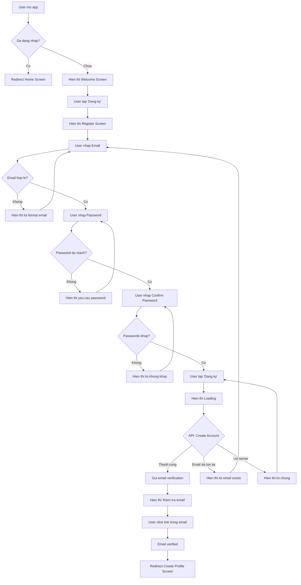
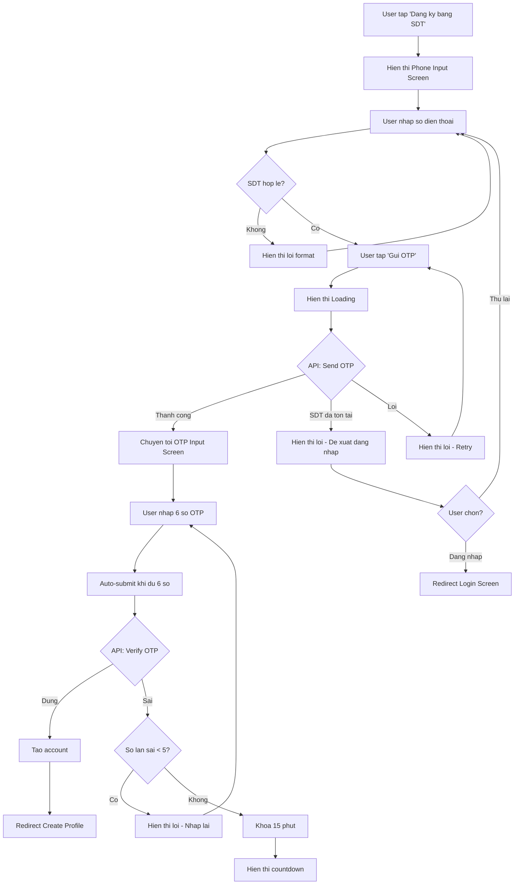
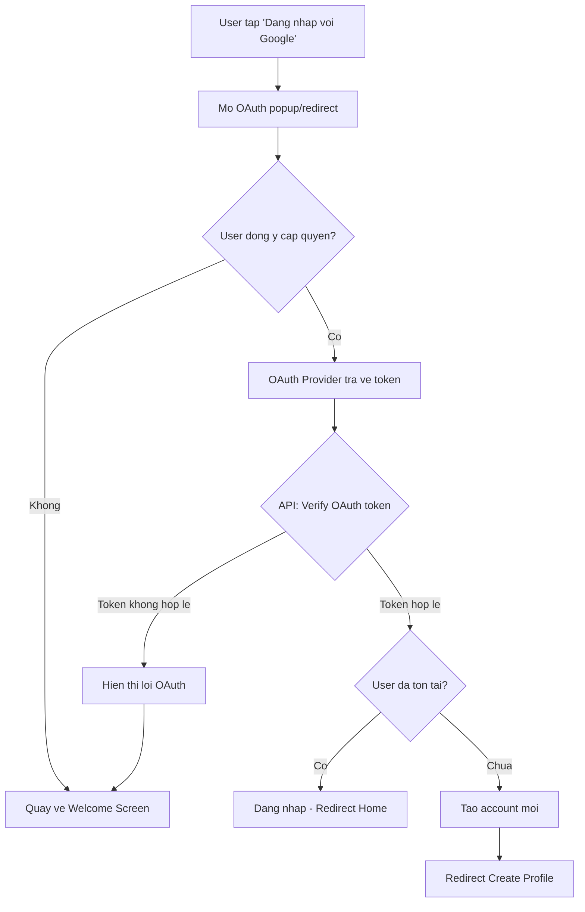
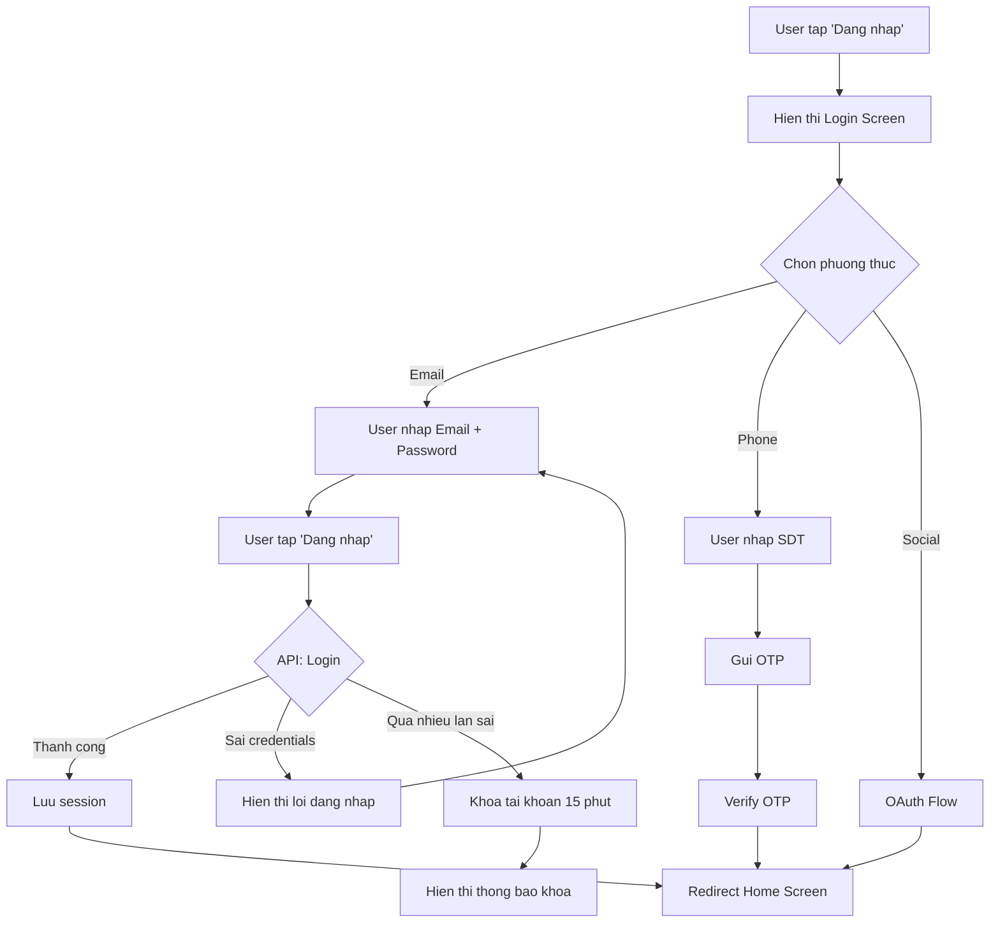
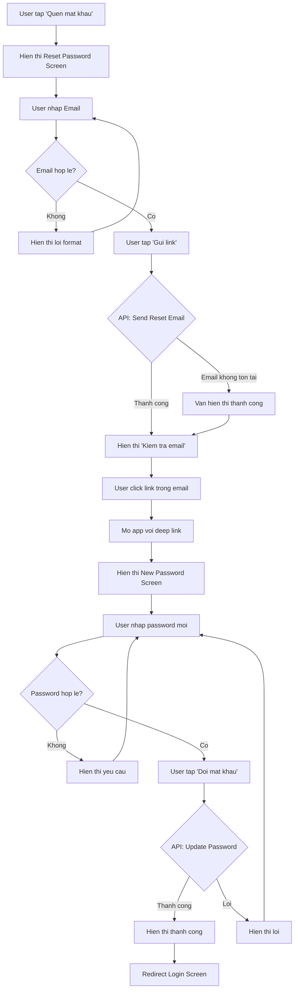

# Activity Diagram: User Registration & Authentication (F01)

## Feature Overview
Cho phep nguoi dung dang ky tai khoan moi va dang nhap vao ung dung qua nhieu phuong thuc: email/password, so dien thoai/OTP, hoac social login (Google, Facebook, Apple).

## Actors
- **Primary**: User (nguoi dung chua dang nhap)
- **Secondary**:
  - Authentication System (Supabase Auth)
  - Email/SMS Provider (gui OTP, verification)
  - OAuth Providers (Google, Facebook, Apple)

---

## Main Flow

### Flow 1: Dang ky bang Email + Password

#### Happy Path Steps
1. **User mo app**
   - System kiem tra session trong SecureStore
   - Neu co valid token → redirect Home

2. **User chon Dang ky**
   - Hien thi form dang ky

3. **User nhap thong tin**
   - Email: validate format realtime
   - Password: min 8 ky tu, 1 uppercase, 1 number
   - Confirm password: match validation

4. **Submit dang ky**
   - Call Supabase Auth signup
   - Gui email verification
   - Luu session

5. **Email verification**
   - User click link trong email
   - Redirect ve app voi deep link
   - Chuyen toi Create Profile

---

### Flow 2: Dang ky bang Phone + OTP

#### Happy Path Steps
1. **Nhap so dien thoai**
   - Format: +84 hoac 0xxx
   - Validate so dien thoai VN

2. **Gui OTP**
   - System gui SMS qua provider
   - OTP co hieu luc 5 phut

3. **Nhap OTP**
   - 6 so, auto-focus next input
   - Auto-submit khi du

4. **Verify va tao account**
   - Tao user trong Supabase
   - Luu session

---

### Flow 3: Social Login (Google/Facebook/Apple)

#### Happy Path Steps
1. **Chon provider**
   - Google, Facebook, hoac Apple (iOS only)

2. **OAuth flow**
   - Redirect toi provider
   - User cap quyen

3. **Xu ly token**
   - Verify token voi Supabase
   - Tao/link account
   - Redirect tuong ung

---

### Flow 4: Dang nhap (Returning User)

---

### Flow 5: Reset Password

---

## Alternative Flows

### Alt 1: Deep Link tu Email Verification
**Trigger**: User click verification link nhung app chua cai
1. Mo App Store/Play Store
2. User cai app
3. Mo app, deep link duoc xu ly
4. Redirect dung screen

### Alt 2: Social Account da Link
**Trigger**: User dang ky social nhung email da ton tai
1. Hien thi thong bao "Email nay da duoc dang ky"
2. De xuat link account hoac dang nhap

### Alt 3: Session Het Han
**Trigger**: User mo app, token het han
1. Thu refresh token
2. Neu thanh cong → tiep tuc
3. Neu that bai → redirect Login

---

## Error Handling

### Error 1: Network Error
- **Trigger**: Khong co internet khi submit
- **System**: Hien thi "Khong co ket noi mang"
- **User**: Kiem tra mang va thu lai
- **UI**: Button "Thu lai"

### Error 2: Invalid Credentials
- **Trigger**: Email/password sai
- **System**: Hien thi "Email hoac mat khau khong dung"
- **User**: Nhap lai hoac reset password
- **Security**: Khong tiet lo email co ton tai hay khong

### Error 3: Account Locked
- **Trigger**: Qua 5 lan dang nhap sai
- **System**: Khoa 15 phut, hien thi countdown
- **User**: Doi het thoi gian hoac reset password
- **Security**: Log suspicious activity

### Error 4: OTP Expired
- **Trigger**: Nhap OTP sau 5 phut
- **System**: Hien thi "Ma OTP het han"
- **User**: Yeu cau gui lai OTP
- **Limit**: Toi da 3 lan gui lai / session

### Error 5: OAuth Cancelled
- **Trigger**: User dong popup OAuth
- **System**: Quay ve Welcome screen
- **User**: Thu lai hoac chon phuong thuc khac

### Error 6: Email Not Verified
- **Trigger**: User dang nhap khi chua verify email
- **System**: Hien thi "Vui long xac thuc email"
- **User**: Check email hoac gui lai verification
- **UI**: Button "Gui lai email xac thuc"

---

## Edge Cases

1. **User doi email/phone khi dang verify**: Huy OTP/link cu, gui moi
2. **Multiple devices**: Cho phep dang nhap dong thoi (luu nhieu sessions)
3. **App bi kill khi dang OAuth**: Resume flow khi mo lai
4. **Email trong spam folder**: Huong dan user check spam
5. **SDT khong nhan duoc OTP**: Option gui lai sau 60s
6. **Password manager autofill**: Support autofill attributes
7. **Biometric login**: Future feature (out of MVP scope)

---

## Dependencies

- **Requires**: None (entry point cua app)
- **Required by**: F02, F03, F04, F05, F06, F07, F08, F09, F10, F11, F12
- **Integrates with**:
  - Supabase Auth
  - Google OAuth
  - Facebook OAuth
  - Apple Sign In
  - SMS Provider (cho OTP)
  - Email Provider (cho verification)

---

## Security Notes

1. **Password Requirements**
   - Min 8 characters
   - At least 1 uppercase
   - At least 1 number
   - Khong cho phep common passwords

2. **Rate Limiting**
   - Login: 5 attempts / 15 min / IP
   - OTP: 3 sends / session
   - Password reset: 3 / hour / email

3. **Token Storage**
   - Access token: SecureStore (encrypted)
   - Refresh token: SecureStore (encrypted)
   - Never store in AsyncStorage

4. **Session Management**
   - Access token: 15 min expiry
   - Refresh token: 7 days expiry
   - Force logout on password change

---

## UI/UX Notes

1. **Welcome Screen**
   - Logo + tagline
   - Social login buttons (prominent)
   - Email/Phone options (secondary)
   - Terms & Privacy links

2. **Form Validation**
   - Realtime validation khi blur
   - Clear error messages
   - Password strength indicator

3. **Loading States**
   - Button loading spinner
   - Disable form khi submitting
   - Skeleton screens

4. **Success Feedback**
   - Success animation khi verify
   - Clear next step instructions
