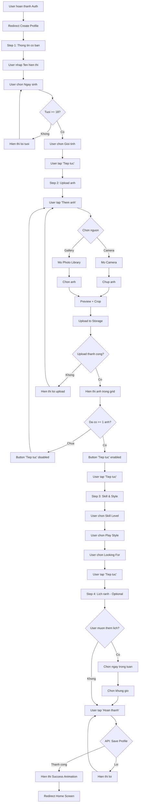
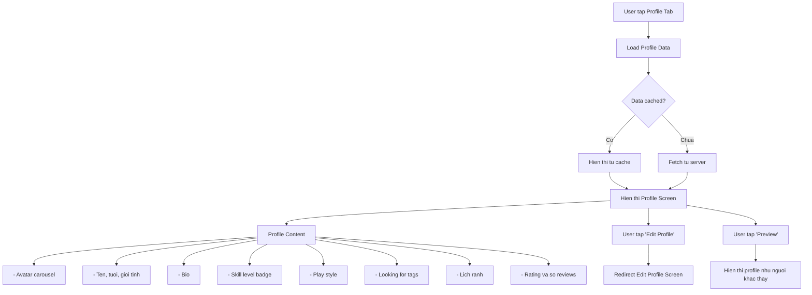
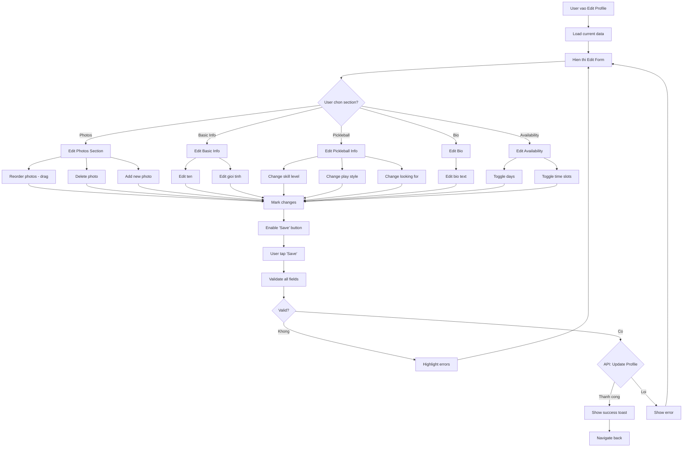
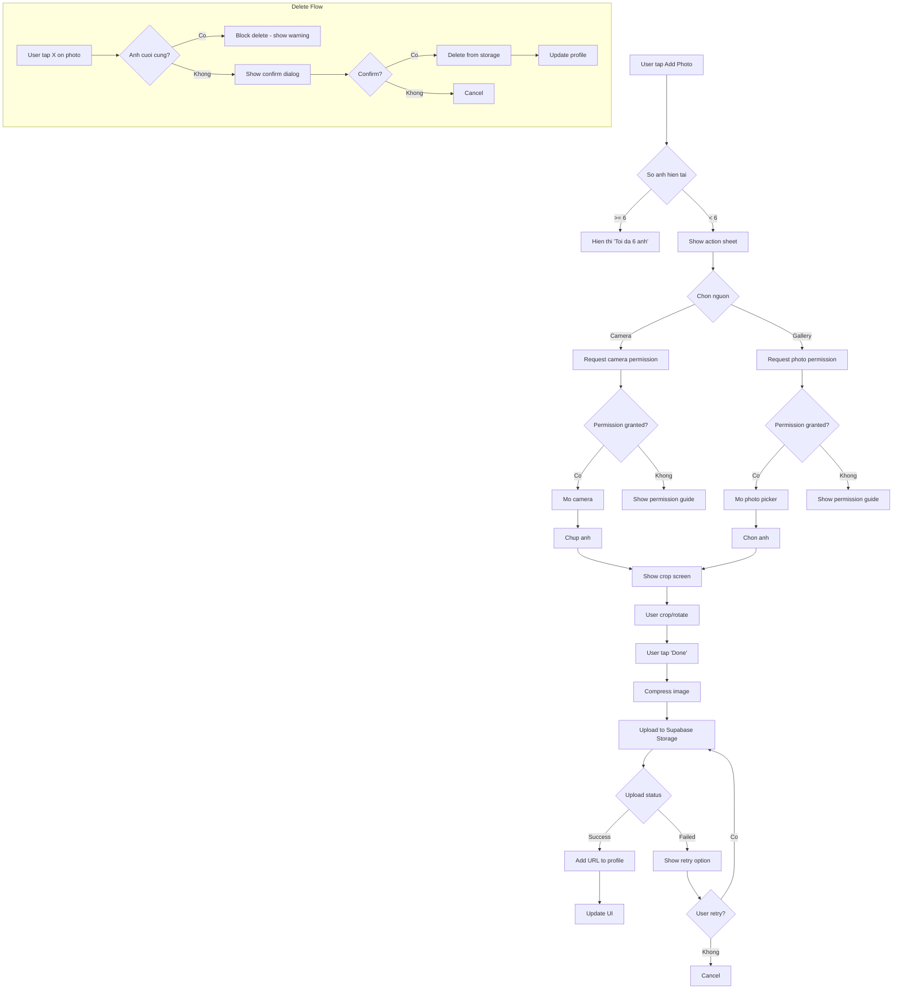

# Activity Diagram: User Profile (F02)

## Feature Overview
Cho phep nguoi dung tao va quan ly profile ca nhan voi thong tin pickleball (skill level, phong cach choi, lich ranh), anh dai dien, va cac tuy chon hien thi de thu hut nguoi choi khac.

## Actors
- **Primary**: Authenticated User
- **Secondary**:
  - Storage System (Supabase Storage - upload anh)
  - CDN (serve images)

---

## Main Flow

### Flow 1: Tao Profile Lan Dau (Onboarding)

#### Onboarding Steps
1. **Step 1: Basic Info** (Required)
   - Ten hien thi (2-30 ky tu)
   - Ngay sinh (must be 18+)
   - Gioi tinh (Male/Female/Other)

2. **Step 2: Photos** (Required min 1)
   - Upload 1-6 anh
   - First photo = avatar
   - Support crop/rotate

3. **Step 3: Pickleball Info** (Required)
   - Skill level: Beginner/Intermediate/Advanced/Pro
   - Play style: Competitive/Casual/Social
   - Looking for: Opponent/Doubles Partner/Dating/All (multi-select)

4. **Step 4: Availability** (Optional)
   - Chon ngay trong tuan
   - Chon khung gio (sang/chieu/toi)
   - Co the skip

---

### Flow 2: Xem Profile Cua Minh

---

### Flow 3: Chinh Sua Profile

---

### Flow 4: Upload/Manage Photos

---

## Alternative Flows

### Alt 1: Skip Optional Fields
**Trigger**: User khong muon dien day du
- Bio: co the de trong
- Availability: co the skip
- Location: co the skip (dung GPS khi can)
- Profile van hoan thanh nhung match quality thap hon

### Alt 2: Change Avatar
**Trigger**: User muon doi anh dai dien
1. Vao edit photos
2. Drag anh muon lam avatar len vi tri dau
3. Hoac tap "Set as main" tren anh

### Alt 3: Profile Not Complete
**Trigger**: User roi app giua onboarding
1. Luu draft profile
2. Khi quay lai, hien thi "Hoan thanh profile"
3. Resume tu buoc dang dien

---

## Error Handling

### Error 1: Image Upload Failed
- **Trigger**: Network error hoac file qua lon
- **System**:
  - Retry 3 lan tu dong
  - Neu van fail, show error
- **User**: Thu lai voi anh khac hoac kiem tra mang
- **Limit**: Max 5MB per image

### Error 2: Invalid Image Format
- **Trigger**: File khong phai image
- **System**: "Chi ho tro dinh dang JPG, PNG, HEIC"
- **User**: Chon file khac

### Error 3: Profile Save Failed
- **Trigger**: Server error khi save
- **System**:
  - Luu local draft
  - "Khong the luu. Thu lai sau."
- **User**: Thu lai hoac tiep tuc dung (data duoc luu local)

### Error 4: Duplicate Display Name
- **Trigger**: Ten da duoc su dung (neu enforce unique)
- **System**: "Ten nay da duoc su dung"
- **Note**: Hien tai khong enforce unique, chi validate length

### Error 5: Camera/Photo Permission Denied
- **Trigger**: User denied permission
- **System**: Show guide cach bat permission trong Settings
- **User**: Vao Settings -> App -> Permissions

---

## Edge Cases

1. **Tuoi thay doi qua nam moi**: Hien thi tuoi hien tai, tinh tu DOB
2. **User muon an tuoi**: Privacy setting - hien thi range thay vi exact
3. **Anh bi xoa tren storage**: Show placeholder, prompt re-upload
4. **Bio qua dai**: Max 500 chars voi counter
5. **Special characters trong ten**: Allow Unicode, filter emojis
6. **User thay doi skill sau match**: Khong affect existing matches
7. **Multiple looking_for options**: Store as array, match neu co giao
8. **Timezone khac nhau**: Luu availability theo local time cua user

---

## Dependencies

- **Requires**: F01 (User Authentication)
- **Required by**: F03 (Swipe Matching), F04 (Match Management), F09 (Rating)
- **Integrates with**:
  - Supabase Storage (images)
  - Image compression library
  - Date picker component
  - Photo cropper component

---

## Data Validation Rules

| Field | Rules |
|-------|-------|
| display_name | 2-30 chars, no leading/trailing spaces |
| date_of_birth | Must be 18+ years old |
| gender | Enum: male, female, other |
| bio | Max 500 chars |
| skill_level | Enum: beginner, intermediate, advanced, pro |
| play_style | Enum: competitive, casual, social |
| looking_for | Array of: opponent, doubles_partner, dating |
| avatar_urls | 1-6 URLs, valid image format |
| availability | JSON: {day: [time_slots]} |

---

## UI/UX Notes

1. **Onboarding Progress**
   - Progress bar o tren
   - Step indicator (1/4, 2/4...)
   - Back button de quay lai step truoc
   - Skip button cho optional steps

2. **Photo Grid**
   - 2x3 grid layout
   - First slot luon la main photo
   - Empty slots show "+" icon
   - Drag to reorder

3. **Skill Level Selection**
   - Visual cards voi icon
   - Brief description cho moi level
   - Highlight selected

4. **Availability Picker**
   - Week view
   - Tap to toggle day
   - Time slots: Morning/Afternoon/Evening
   - Visual feedback khi selected

5. **Profile Preview**
   - Swipe through photos
   - Exact layout nhu nguoi khac thay
   - "This is how others see you"
