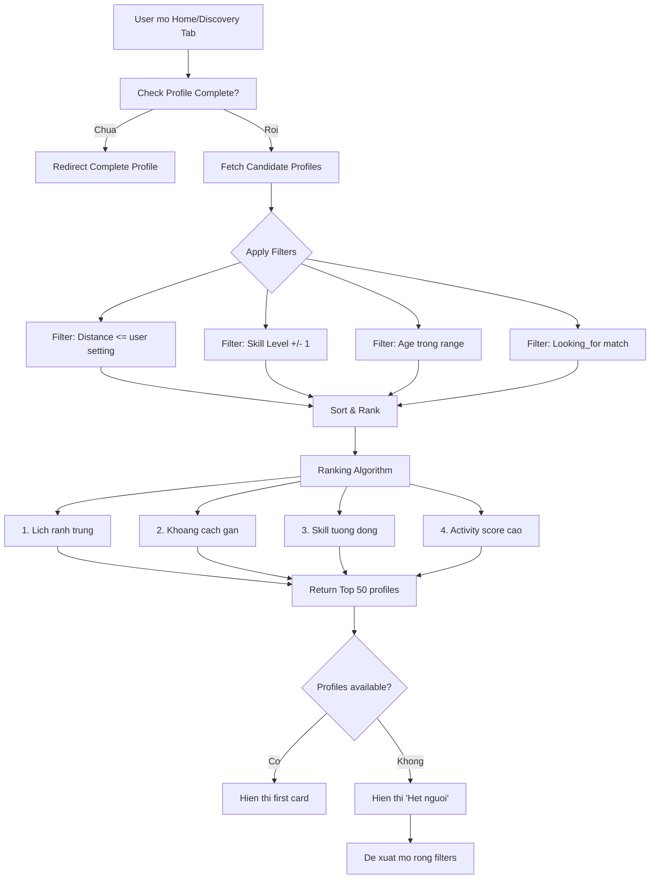
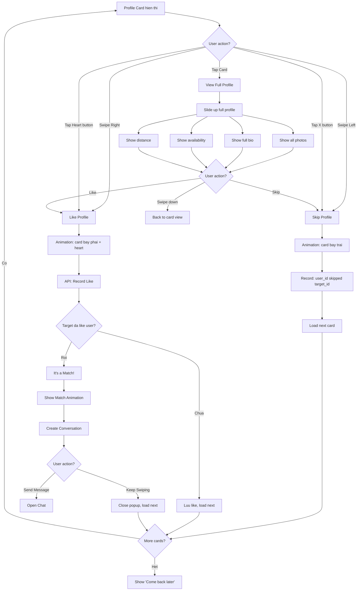
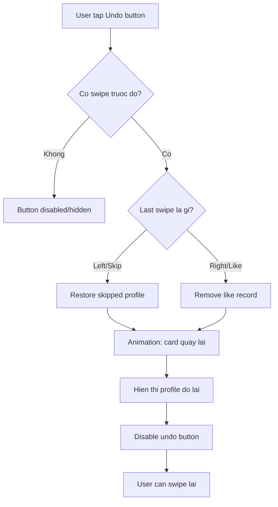
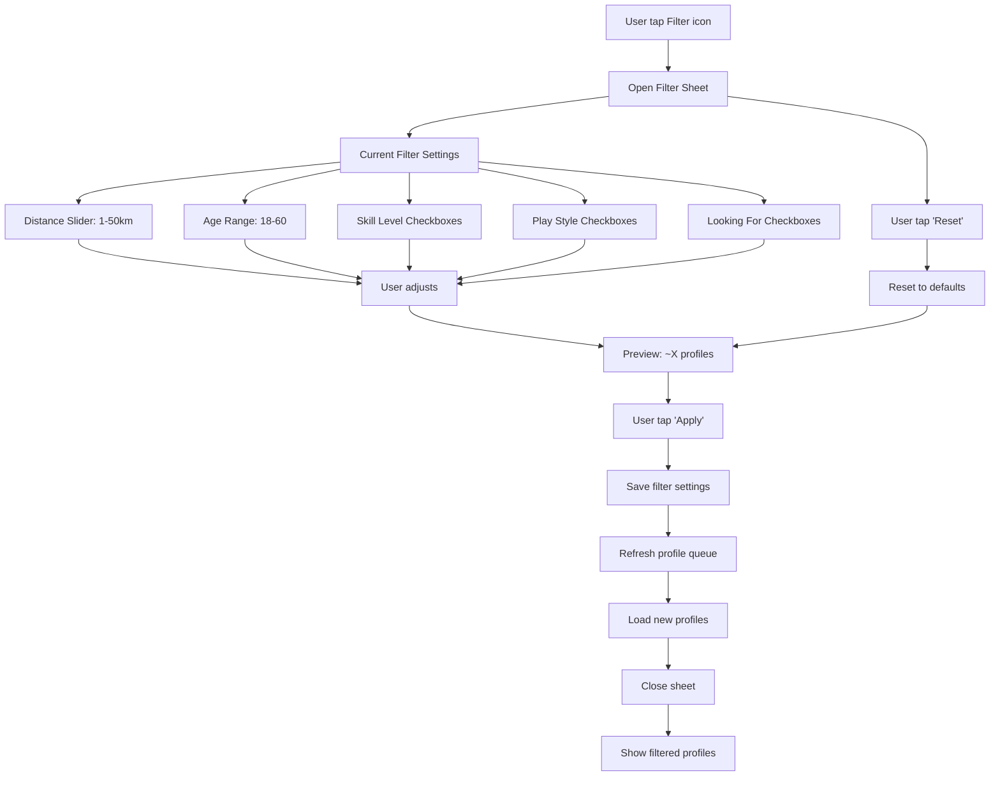

# Activity Diagram: Swipe-based Matching (F03)

## Feature Overview
Core feature cua app - cho phep user duyet qua cac profiles va swipe left (skip) hoac right (like). Khi ca hai user swipe right cho nhau, tao match va cho phep nhan tin.

## Actors
- **Primary**: Authenticated User
- **Secondary**:
  - Matching Algorithm (backend)
  - Push Notification Service

---

## Main Flow

### Flow 1: Load va Hien thi Profiles



---

### Flow 2: Swipe Interaction



---

### Flow 3: Undo Last Swipe



**Note**: Undo chi co 1 lan cho swipe gan nhat. Sau khi undo, phai swipe moi co the undo tiep.

---

### Flow 4: Filter Settings



---

## Matching Algorithm

### Priority Ranking (descending importance)

```
Score = W1*AvailabilityScore + W2*DistanceScore + W3*SkillScore + W4*ActivityScore

Where:
- W1 = 0.35 (Lich ranh trung)
- W2 = 0.30 (Khoang cach)
- W3 = 0.20 (Skill tuong dong)
- W4 = 0.15 (Activity level)
```

### Scoring Details

1. **Availability Score (0-100)**
   - 100: >= 3 slots chung
   - 70: 2 slots chung
   - 40: 1 slot chung
   - 0: Khong co slot chung

2. **Distance Score (0-100)**
   - 100: <= 5km
   - 80: 5-10km
   - 60: 10-20km
   - 40: 20-30km
   - 20: 30-50km
   - 0: > 50km

3. **Skill Score (0-100)**
   - 100: Cung level
   - 70: Chenh 1 level
   - 30: Chenh 2 levels
   - 0: Chenh > 2 levels

4. **Activity Score (0-100)**
   - Based on: last login, swipe frequency, response rate
   - Active users duoc uu tien

### Filters Applied (Hard Constraints)

```sql
WHERE
    distance <= user.max_distance
    AND age BETWEEN user.min_age AND user.max_age
    AND skill_level IN user.preferred_skills (if set)
    AND NOT IN (already_swiped_by_user)
    AND NOT IN (blocked_by_either)
    AND profile_complete = true
    AND is_active = true
```

---

## Alternative Flows

### Alt 1: Super Like (Future Feature)
**Trigger**: User tap star button hoac swipe up
- Limited: 1/day (free), more with premium
- Notify target immediately
- Highlight trong target's queue

### Alt 2: No Profiles Available
**Trigger**: Het nguoi trong filter range
1. Show empty state
2. Suggest: "Mo rong khoang cach?" / "Thay doi skill filter?"
3. Show button to adjust filters
4. Hoac: "Quay lai sau!"

### Alt 3: Profile Reported/Blocked
**Trigger**: Target bi report nhieu
- Khong hien thi trong queue
- Neu da match, bi remove

---

## Error Handling

### Error 1: Load Profiles Failed
- **Trigger**: Network error
- **System**: Show cached profiles (neu co)
- **User**: Pull to refresh
- **Fallback**: "Kiem tra ket noi mang"

### Error 2: Swipe Not Recorded
- **Trigger**: Network error khi swipe
- **System**:
  - Queue swipe locally
  - Retry khi co mang
  - UI van tiep tuc binh thuong
- **User**: Khong bi interrupt

### Error 3: Match Creation Failed
- **Trigger**: Server error khi tao match
- **System**:
  - Retry 3 times
  - Neu fail, log error
  - Van show success (eventual consistency)
- **User**: Co the khong thay match ngay

### Error 4: Profile Data Incomplete
- **Trigger**: Target profile thieu data
- **System**: Skip profile do, load next
- **Logging**: Report de fix data

---

## Edge Cases

1. **User swipe chinh minh**: Filter out trong query
2. **Mutual block**: Ca hai khong thay nhau
3. **User thay doi filter khi dang swipe**: Refresh queue
4. **Queue het giua session**: Load them, show loading
5. **Profile bi xoa sau khi load**: Skip, khong show error
6. **User offline**:
   - Show cached cards
   - Queue swipes
   - Sync khi online
7. **Rapid swiping**: Debounce API calls, batch swipes
8. **Same person different sessions**: Nho vi tri trong queue

---

## Dependencies

- **Requires**:
  - F01 (Authentication)
  - F02 (Complete Profile)
- **Required by**:
  - F04 (Match Management)
  - F05 (Chat)
- **Integrates with**:
  - F08 (Push Notifications - notify match)
  - Location services (distance calculation)

---

## Performance Considerations

1. **Card Preloading**
   - Preload next 5 cards
   - Preload images of next 3 profiles
   - Background fetch khi queue < 10

2. **Image Optimization**
   - Use thumbnail for cards
   - Full resolution chi khi view full profile
   - Progressive loading

3. **Animation Performance**
   - Use React Native Reanimated
   - Run on UI thread
   - Target 60fps

4. **API Efficiency**
   - Batch fetch 50 profiles
   - Cache swipe decisions locally
   - Batch sync swipes (every 5 swipes or 30s)

---

## UI/UX Notes

1. **Card Design**
   - Full screen card (anh chinh)
   - Name, age o bottom
   - Skill badge
   - Distance indicator
   - Gradient overlay de text doc duoc

2. **Swipe Feedback**
   - Card rotate khi drag
   - "LIKE" / "NOPE" text xuat hien
   - Color feedback (green/red)
   - Haptic feedback

3. **Match Animation**
   - Confetti effect
   - Both avatars slide in
   - "It's a Match!" text
   - CTA buttons: Message / Keep Swiping

4. **Empty State**
   - Friendly illustration
   - Encouraging message
   - Action button (adjust filters)

5. **Filter UI**
   - Bottom sheet (slide up)
   - Preview count real-time
   - Easy reset to defaults
