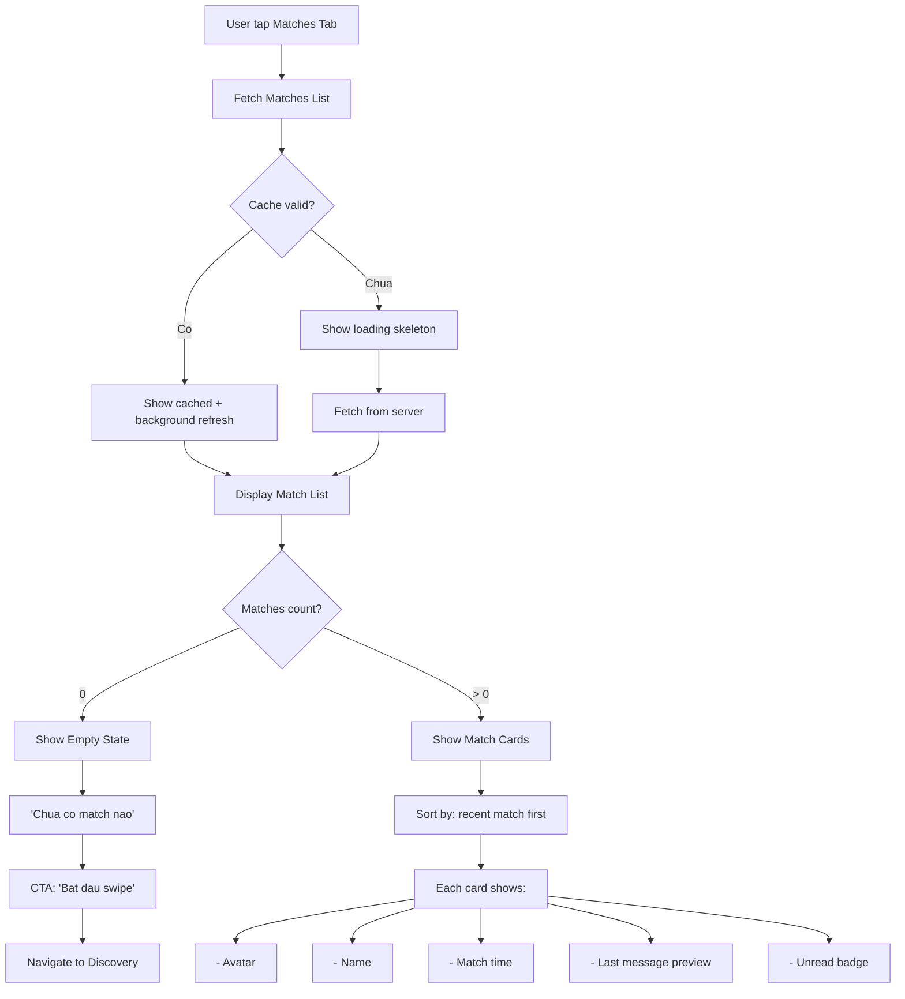
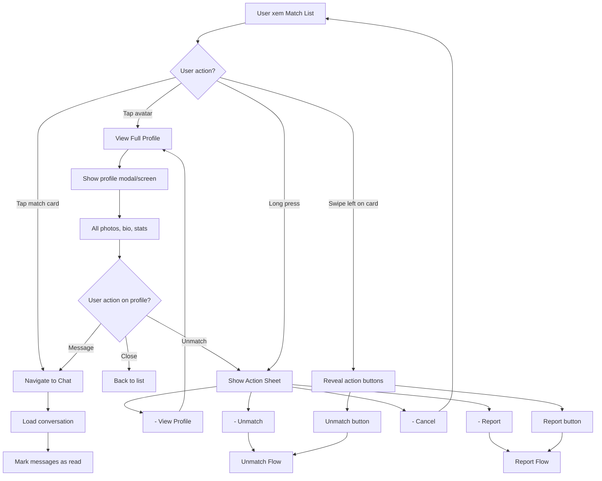
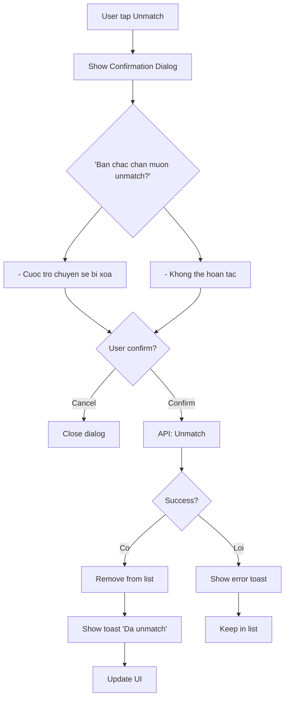
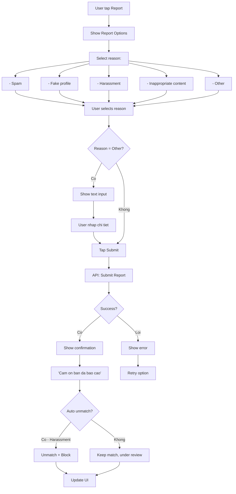
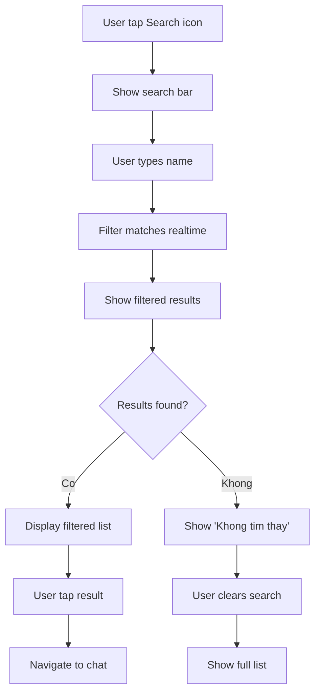
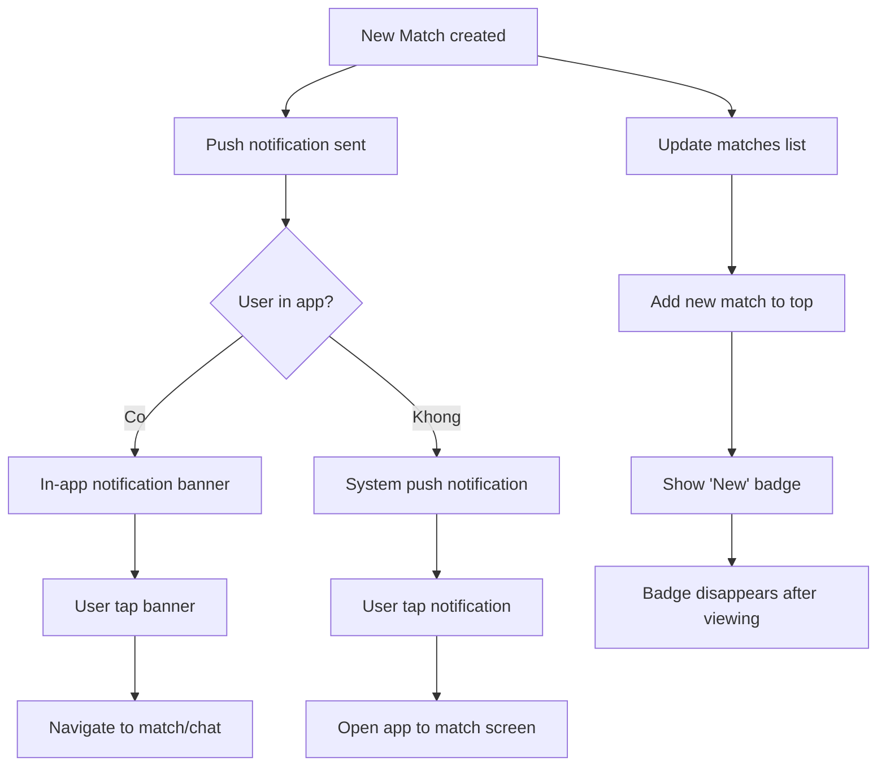

# Activity Diagram: Match Management (F04)

## Feature Overview
Quan ly danh sach nguoi da match - xem, sap xep, truy cap nhanh vao chat, xem profile, unmatch hoac report nguoi dung khong phu hop.

## Actors
- **Primary**: Authenticated User (da co matches)
- **Secondary**:
  - Moderation System (xu ly reports)

---

## Main Flow

### Flow 1: Xem Danh Sach Matches



---

### Flow 2: Tuong Tac Voi Match Item



---

### Flow 3: Unmatch



**Unmatch Effects:**
- Conversation deleted for both users
- Match record removed
- Cannot swipe each other again for 30 days
- No notification to other user

---

### Flow 4: Report User



**Report Flow Details:**
- Harassment/Inappropriate: Auto unmatch + block
- Other reasons: Review by moderation team
- User can optionally block after reporting
- Report logged with timestamp, reason, context

---

### Flow 5: Search/Filter Matches



---

### Flow 6: New Match Notification



---

## Alternative Flows

### Alt 1: Match Expired
**Trigger**: Match khong nhan tin trong 14 ngay
- Show "Conversation expiring soon" warning
- Sau 14 ngay, gray out match
- Option: Extend hoac let expire

**Note**: Feature nay co the skip cho MVP

### Alt 2: Blocked User Tries to Match
**Trigger**: User da bi block
- Block user khong thay trong swipe queue
- Neu da match truoc do, match bi an

### Alt 3: Account Deleted
**Trigger**: Match's account bi xoa
- Match bi remove tu list
- Conversation archived (khong truy cap duoc)
- Show "User khong con tren ung dung"

---

## Error Handling

### Error 1: Load Matches Failed
- **Trigger**: Network error
- **System**: Show cached data neu co
- **User**: Pull to refresh
- **Fallback**: Error screen voi retry button

### Error 2: Unmatch Failed
- **Trigger**: Server error
- **System**: Show error toast
- **User**: Thu lai sau
- **Note**: Khong auto-retry (destructive action)

### Error 3: Report Failed
- **Trigger**: Server error
- **System**: Save report locally
- **User**: "Bao cao se duoc gui khi co mang"
- **Background**: Retry khi online

### Error 4: Real-time Update Failed
- **Trigger**: WebSocket disconnect
- **System**: Fallback to polling (30s)
- **User**: May have slight delay
- **Recovery**: Auto-reconnect

---

## Edge Cases

1. **Unmatch while chatting**: Close chat, redirect to list
2. **Both report each other**: Both reports logged, investigate
3. **Match deleted giua session**: Remove tu list, show toast
4. **100+ matches**: Paginate, load 20 at a time
5. **Duplicate reports**: Ignore, keep first report
6. **User unmatch themselves**: Not possible (filter in query)
7. **Slow connection**: Show optimistic UI, rollback if fail

---

## Dependencies

- **Requires**:
  - F01 (Authentication)
  - F03 (Swipe Matching - creates matches)
- **Required by**:
  - F05 (Chat - access via match)
- **Integrates with**:
  - F08 (Push Notifications)
  - Moderation system (reports)

---

## Data Structure

### Match Object
```typescript
interface Match {
  id: string;
  user_id: string;
  matched_user_id: string;
  matched_at: DateTime;
  conversation_id: string;
  last_message?: {
    content: string;
    sent_at: DateTime;
    sender_id: string;
  };
  unread_count: number;
  is_new: boolean; // chua xem
  matched_user: {
    id: string;
    display_name: string;
    avatar_url: string;
    is_online: boolean;
    last_active: DateTime;
  };
}
```

### Report Object
```typescript
interface Report {
  id: string;
  reporter_id: string;
  reported_user_id: string;
  reason: 'spam' | 'fake' | 'harassment' | 'inappropriate' | 'other';
  details?: string;
  created_at: DateTime;
  status: 'pending' | 'reviewed' | 'resolved';
  action_taken?: string;
}
```

---

## UI/UX Notes

1. **Match List Design**
   - Avatar prominent (circle, 56px)
   - Name + last message preview
   - Time badge (2h ago, Yesterday)
   - Unread indicator (blue dot)
   - New match: "New" badge

2. **Empty State**
   - Friendly illustration
   - Encouraging message
   - CTA button to swipe

3. **Action Sheet**
   - View Profile
   - Unmatch (red text)
   - Report (red text)
   - Cancel

4. **Confirmation Dialog**
   - Clear consequences
   - Destructive button red
   - Cancel button prominent

5. **Real-time Updates**
   - New match appears at top
   - Message preview updates live
   - Online status dot (green/gray)

6. **Swipe Actions**
   - Swipe left reveals buttons
   - Quick unmatch/report
   - Familiar iOS pattern
