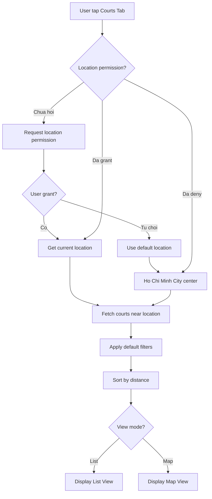
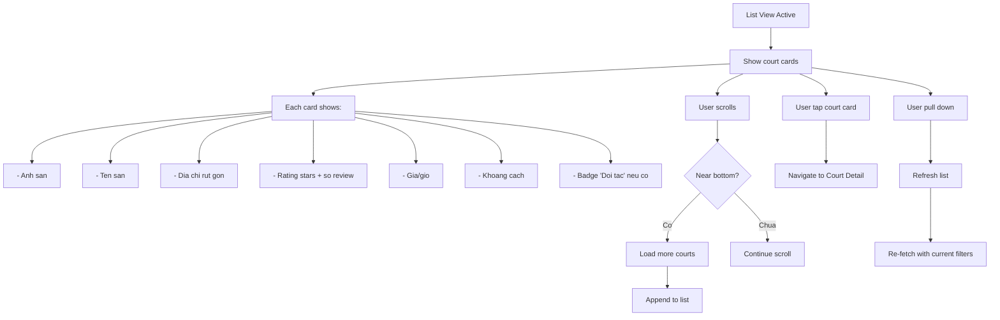
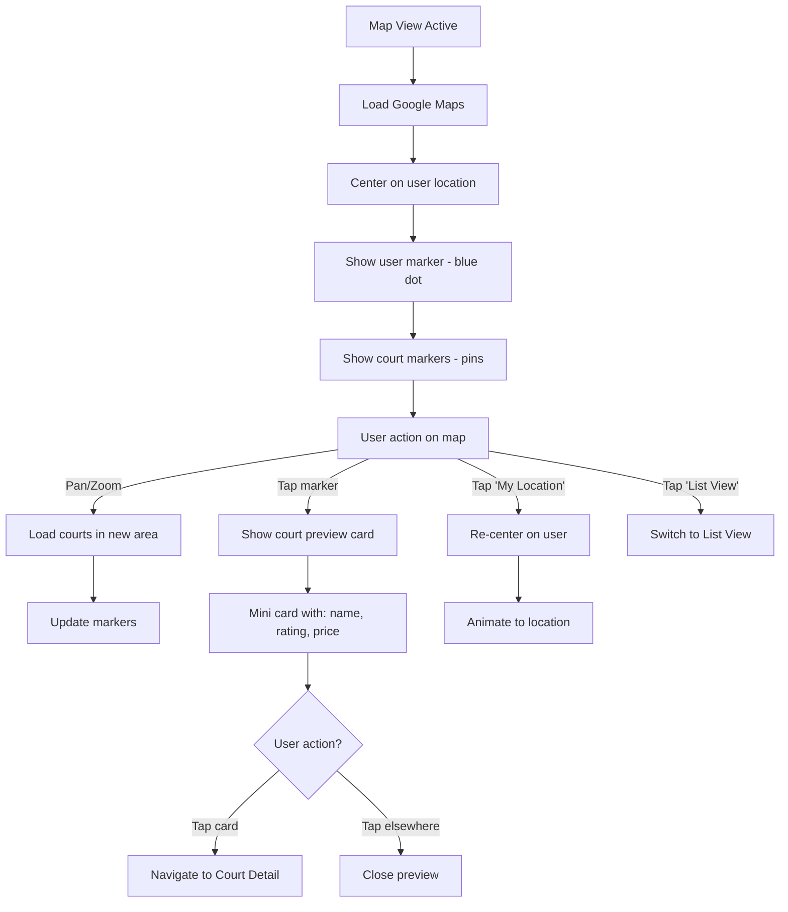
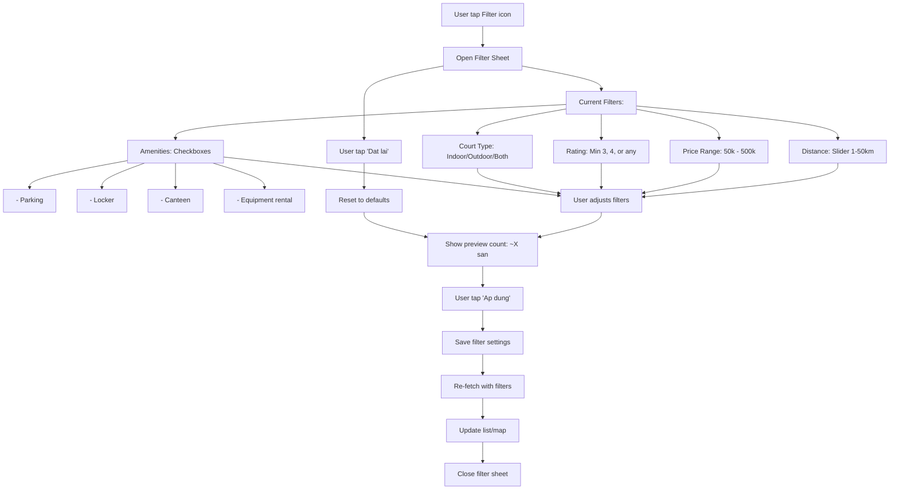
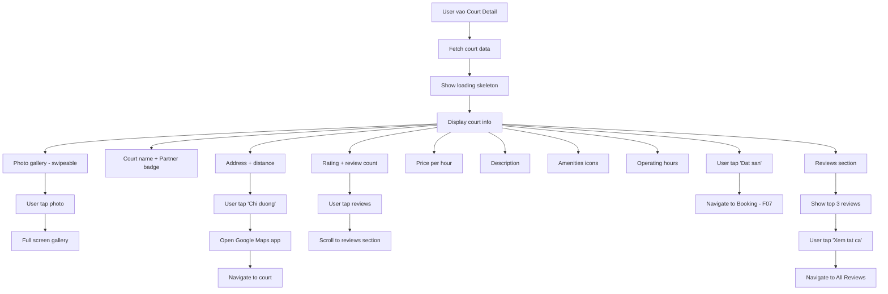
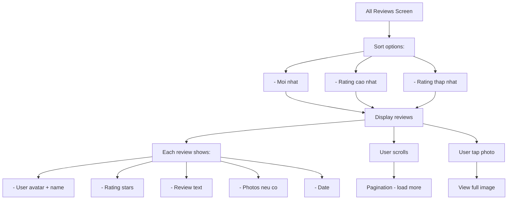

# Activity Diagram: Court Discovery (F06)

## Feature Overview
Cho phep nguoi dung tim kiem va kham pha cac san pickleball gan vi tri hien tai. Ho tro hien thi dang danh sach va ban do, filter theo nhieu tieu chi, xem chi tiet san.

## Actors
- **Primary**: Authenticated User
- **Secondary**:
  - Location Service (GPS)
  - Google Maps API
  - Court Database (managed by admin)

---

## Main Flow

### Flow 1: Truy Cap Court Discovery



---

### Flow 2: List View



---

### Flow 3: Map View



---

### Flow 4: Search Courts

```mermaid
flowchart TD
    A[User tap search bar] --> B[Show search screen]
    B --> C[Keyboard opens]
    C --> D[User types query]
    D --> E{Query length >= 2?}
    E -->|Chua| F[Show recent searches]
    E -->|Co| G[Debounce 300ms]
    G --> H[Search API call]
    H --> I[Search by:]
    I --> J[- Ten san]
    I --> K[- Dia chi]
    I --> L[- Khu vuc]
    J --> M[Show results]
    K --> M
    L --> M
    M --> N{Results found?}
    N -->|Co| O[Display result list]
    N -->|Khong| P[Show 'Khong tim thay']
    P --> Q[Suggest: 'Thu tim "quan 7"']
    O --> R[User tap result]
    R --> S[Navigate to Court Detail]

    B --> T[User tap Cancel]
    T --> U[Close search, back to list/map]
```

---

### Flow 5: Filter Courts



---

### Flow 6: Court Detail



---

### Flow 7: Xem Reviews Cua San



---

## Alternative Flows

### Alt 1: Location Permission Denied
1. Show explanation why location needed
2. Offer manual location selection
3. Search by district/area
4. Button to open Settings

### Alt 2: No Courts Found
1. Show empty state
2. Suggest expanding search radius
3. Show nearby areas with courts
4. CTA: "De xuat san moi"

### Alt 3: Court Closed
1. Show "Tam dong cua" badge
2. Gray out booking button
3. Show expected reopen date (neu co)

---

## Error Handling

### Error 1: Location Error
- **Trigger**: GPS timeout, inaccurate
- **System**: Use last known location
- **Fallback**: Default to city center
- **User**: Manual refresh or select area

### Error 2: Courts Load Failed
- **Trigger**: Network error
- **System**: Show cached courts (if any)
- **User**: Pull to refresh
- **Message**: "Khong the tai danh sach san"

### Error 3: Map Load Failed
- **Trigger**: Google Maps error
- **System**: Fallback to list view only
- **User**: "Ban do khong kha dung"
- **Button**: "Su dung che do danh sach"

### Error 4: Search Failed
- **Trigger**: API error
- **System**: Show error message
- **User**: Try again or browse manually

### Error 5: Court Detail Load Failed
- **Trigger**: Network/server error
- **System**: Show partial cached data
- **User**: Retry button

---

## Edge Cases

1. **No courts in area**: Suggest nearby cities/districts
2. **Court data outdated**: Show "Cập nhật gan nhat: X ngay truoc"
3. **Price varies by time**: Show range "150k - 300k/h"
4. **Seasonal hours**: Show current schedule
5. **New court (no reviews)**: Show "Chua co danh gia"
6. **Court permanently closed**: Remove from list, redirect if accessed via deep link
7. **Multiple locations same name**: Show district in subtitle
8. **Very slow connection**: Progressive loading, skeleton screens

---

## Dependencies

- **Requires**:
  - F01 (Authentication)
  - Location permissions
  - Google Maps API
- **Required by**:
  - F07 (Court Booking)
  - F09 (Rating & Review - court reviews)
- **Integrates with**:
  - Google Maps for directions
  - Admin panel for court data

---

## Data Structure

### Court Object
```typescript
interface Court {
  id: string;
  name: string;
  address: string;
  location: {
    latitude: number;
    longitude: number;
  };
  images: string[];
  description: string;
  amenities: string[];
  price_per_hour: number;
  price_range?: { min: number; max: number };
  court_type: 'indoor' | 'outdoor';
  operating_hours: {
    [day: string]: { open: string; close: string };
  };
  rating: number;
  review_count: number;
  is_partner: boolean;
  is_active: boolean;
  created_at: DateTime;
}
```

### Court Review Object
```typescript
interface CourtReview {
  id: string;
  court_id: string;
  user_id: string;
  user: { name: string; avatar_url: string };
  rating: number;
  comment: string;
  images?: string[];
  created_at: DateTime;
}
```

---

## Performance Considerations

1. **Map Optimization**
   - Cluster markers khi zoom out
   - Load courts in viewport only
   - Debounce pan/zoom events

2. **List Optimization**
   - Paginate 20 courts per page
   - Image lazy loading
   - Skeleton screens

3. **Search Optimization**
   - Debounce input 300ms
   - Cache recent searches
   - Suggest popular queries

4. **Caching Strategy**
   - Cache court list 5 minutes
   - Cache court details 15 minutes
   - Invalidate on booking

---

## UI/UX Notes

1. **Tab Toggle**
   - List / Map toggle prominent
   - Remember last used view
   - Smooth transition

2. **Court Card**
   - Horizontal layout (image left)
   - Key info at glance
   - Partner badge visible
   - Tap area full card

3. **Map Markers**
   - Custom pickleball icon
   - Partner courts different color
   - Cluster for many courts

4. **Filter Sheet**
   - Bottom sheet (drag to expand)
   - Preview count real-time
   - Easy reset

5. **Court Detail**
   - Hero image carousel
   - Sticky book button
   - Collapsible sections
   - Share button

6. **Empty States**
   - Friendly illustration
   - Clear next action
   - Helpful suggestions
