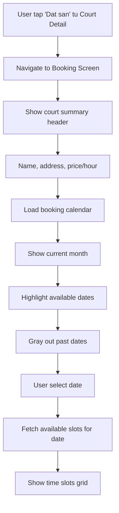
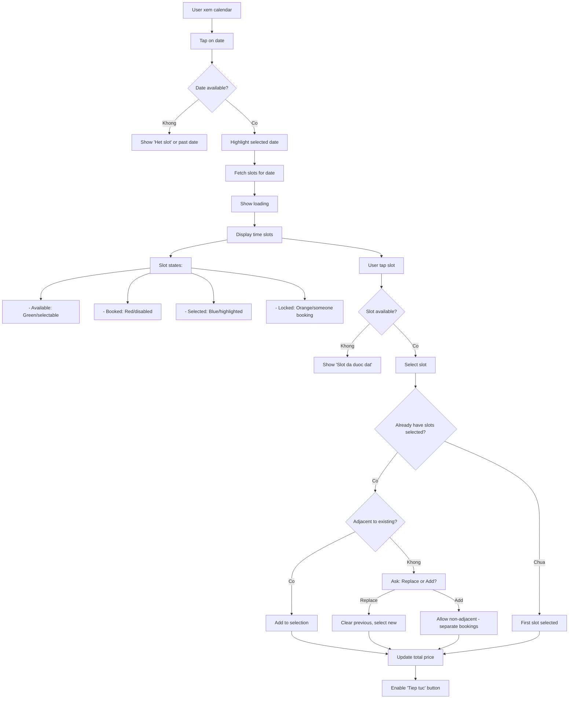
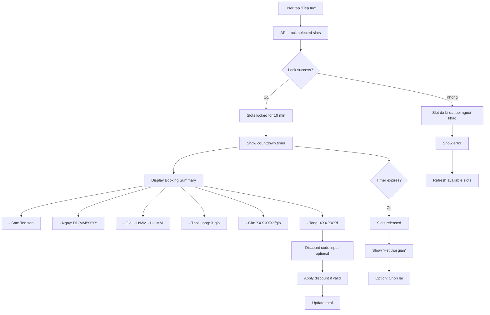
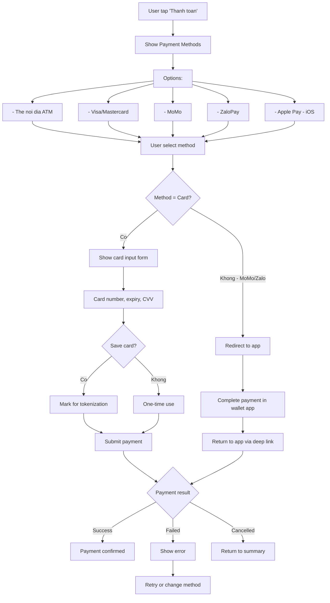
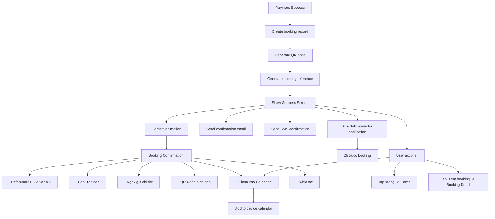
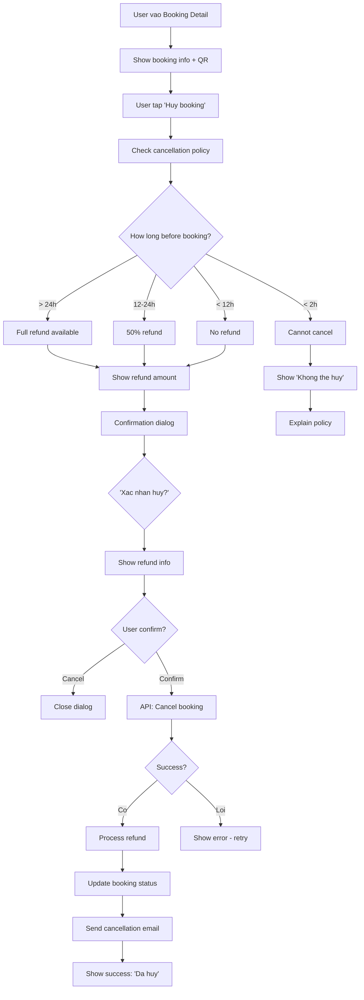

# Activity Diagram: Court Booking (F07)

## Feature Overview
Cho phep nguoi dung dat san pickleball truc tuyen voi quy trinh: chon ngay, chon slot gio, thanh toan, nhan xac nhan va ma QR de check-in tai san.

## Actors
- **Primary**: Authenticated User
- **Secondary**:
  - Payment Gateway (Stripe)
  - Booking System
  - Email/SMS Service (confirmations)
  - QR Code Generator

---

## Main Flow

### Flow 1: Bat Dau Dat San



---

### Flow 2: Chon Ngay va Gio



---

### Flow 3: Lock Slot va Review



---

### Flow 4: Thanh Toan



---

### Flow 5: Xac Nhan Booking



---

### Flow 6: Huy Booking



---

## Alternative Flows

### Alt 1: Invite Match to Booking
**Trigger**: User muon moi nguoi da match choi cung
1. After selecting slots, option "Moi nguoi choi"
2. Show list of matches
3. Select match(es)
4. Send invitation via chat
5. Match co the chap nhan/tu choi
6. Neu chap nhan, chia tien (split payment - future)

**Note**: MVP chi send invitation, chua co split payment

### Alt 2: Rebook from History
**Trigger**: User muon dat lai san da dat truoc
1. Tu Booking History, tap "Dat lai"
2. Pre-fill court selection
3. Show calendar for new date
4. Continue booking flow

### Alt 3: Saved Card Payment
**Trigger**: User co card da luu
1. Show saved cards
2. User select card
3. Enter CVV only
4. Process payment

---

## Error Handling

### Error 1: Slot Conflict
- **Trigger**: Slot bi dat ngay khi user dang thanh toan
- **System**:
  - Detect before payment
  - Show "Slot da bi dat"
  - Suggest alternative slots
- **User**: Chon slot khac

### Error 2: Payment Failed
- **Trigger**: Card declined, insufficient funds
- **System**:
  - Show specific error message
  - Keep slots locked (countdown continues)
- **User**: Retry or change payment method

### Error 3: Payment Gateway Timeout
- **Trigger**: Stripe/MoMo timeout
- **System**:
  - Check payment status
  - If pending, poll for result
  - If failed, allow retry
- **User**: Wait or retry

### Error 4: Lock Expired During Payment
- **Trigger**: 10 min timeout
- **System**:
  - Cancel payment attempt
  - Release slots
  - "Het thoi gian giu slot"
- **User**: Start over

### Error 5: QR Generation Failed
- **Trigger**: Service error
- **System**:
  - Booking still confirmed
  - QR generated later
  - Send via email/SMS
- **User**: "QR se duoc gui qua email"

### Error 6: Network Error During Booking
- **Trigger**: Connection lost
- **System**:
  - If pre-payment: lose lock, retry
  - If during payment: check status when reconnect
  - If post-payment: booking confirmed (server-side)
- **User**: Specific guidance per stage

---

## Edge Cases

1. **Midnight booking**: Handle date change correctly
2. **Timezone differences**: Use court's local timezone
3. **Last slot of day**: Validate against closing time
4. **Concurrent booking attempts**: First to lock wins
5. **Price change during session**: Use price at lock time
6. **Partial day availability**: Show only available slots
7. **Holiday pricing**: Show special price, explain
8. **Double booking prevention**: Database constraint + lock
9. **Booking for tomorrow past midnight**: Allow within policy
10. **Court closes permanently**: Refund pending bookings

---

## Dependencies

- **Requires**:
  - F01 (Authentication)
  - F06 (Court Discovery)
- **Required by**:
  - F09 (Rating & Review - after booking)
  - F11 (Booking History)
- **Integrates with**:
  - Stripe Payment Gateway
  - MoMo/ZaloPay SDK
  - F08 (Push Notifications - reminders)
  - Calendar API (device)
  - Email/SMS services

---

## Data Structure

### Booking Object
```typescript
interface Booking {
  id: string;
  reference: string; // PB-XXXXXX
  user_id: string;
  court_id: string;
  court: { name: string; address: string; };
  date: Date;
  start_time: string; // HH:MM
  end_time: string; // HH:MM
  duration_hours: number;
  price_per_hour: number;
  discount_code?: string;
  discount_amount: number;
  total_amount: number;
  payment_method: string;
  payment_status: 'pending' | 'paid' | 'refunded' | 'partial_refund';
  booking_status: 'confirmed' | 'cancelled' | 'completed' | 'no_show';
  qr_code: string;
  created_at: DateTime;
  cancelled_at?: DateTime;
  cancellation_reason?: string;
}
```

### Slot Object
```typescript
interface TimeSlot {
  court_id: string;
  date: Date;
  start_time: string;
  end_time: string;
  status: 'available' | 'locked' | 'booked';
  locked_by?: string; // user_id
  locked_until?: DateTime;
  booking_id?: string;
  price: number;
}
```

### Payment Object
```typescript
interface Payment {
  id: string;
  booking_id: string;
  amount: number;
  currency: 'VND';
  method: 'card' | 'momo' | 'zalopay' | 'apple_pay';
  status: 'pending' | 'succeeded' | 'failed' | 'refunded';
  stripe_payment_id?: string;
  momo_transaction_id?: string;
  created_at: DateTime;
  completed_at?: DateTime;
}
```

---

## Cancellation Policy

| Time Before Booking | Refund |
|---------------------|--------|
| > 24 hours | 100% |
| 12-24 hours | 50% |
| 2-12 hours | 0% |
| < 2 hours | Cannot cancel |

**Note**: Policy configurable per court

---

## Security Considerations

1. **Payment Security**
   - PCI DSS compliant (Stripe handles card data)
   - Never store raw card numbers
   - Use payment tokens

2. **Slot Lock Security**
   - Verify user owns lock before payment
   - Auto-release on timeout
   - Prevent lock abuse (max 2 concurrent locks)

3. **QR Code Security**
   - One-time use (scan invalidates)
   - Include booking hash for verification
   - Expire after booking time

---

## UI/UX Notes

1. **Calendar Design**
   - Month view, swipe to navigate
   - Today highlighted
   - Available dates in green
   - Selected date with circle

2. **Time Slots Grid**
   - 1-hour slots (or 30-min if court allows)
   - Visual distinction for states
   - Multi-select capability
   - Show price per slot

3. **Countdown Timer**
   - Prominent at top
   - Color change when < 2 min
   - Explain why timer exists

4. **Payment Form**
   - Card input with formatting
   - Card type detection (Visa, MC)
   - Clear CTAs for wallets

5. **Success Screen**
   - Celebratory animation
   - QR prominent
   - Easy add to calendar
   - Share option

6. **Booking Detail**
   - QR large and scannable
   - All booking info
   - Clear cancel policy
   - Navigation to court
