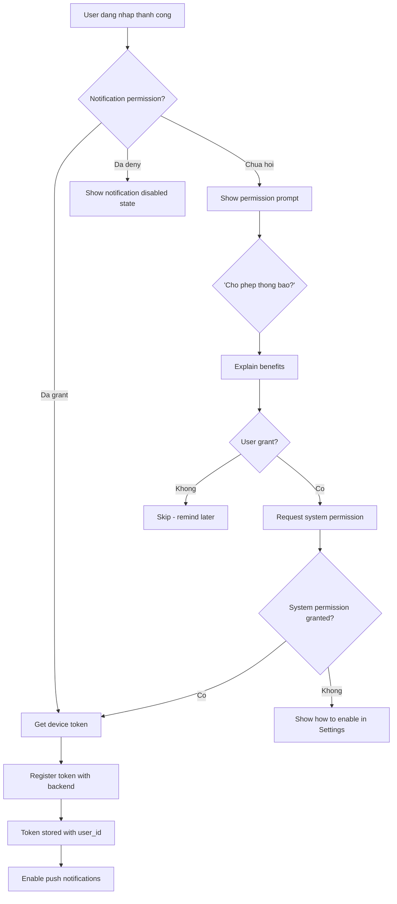
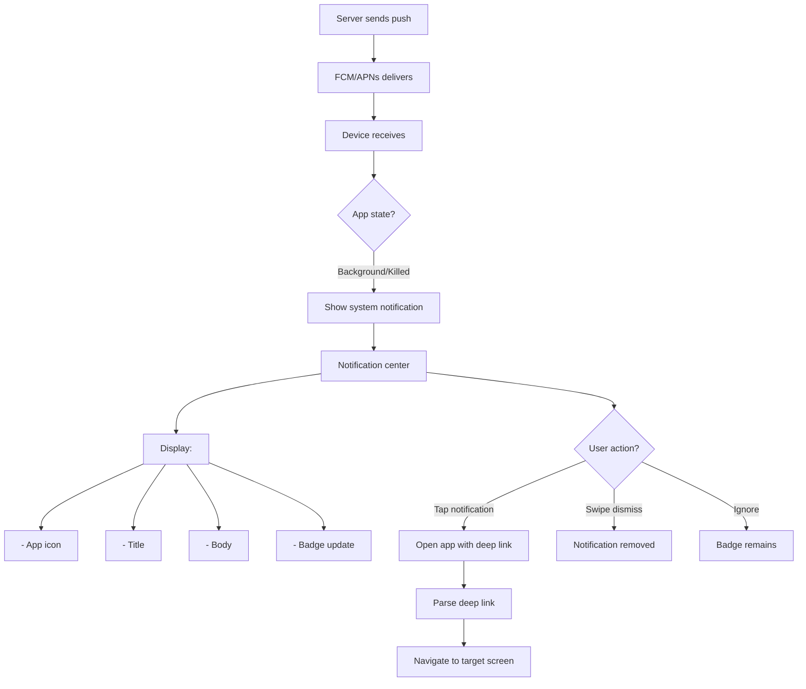
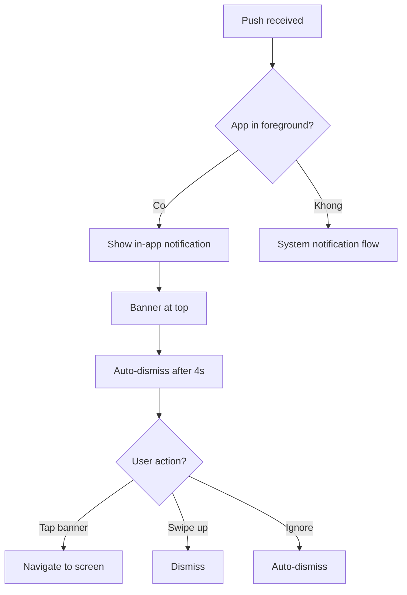
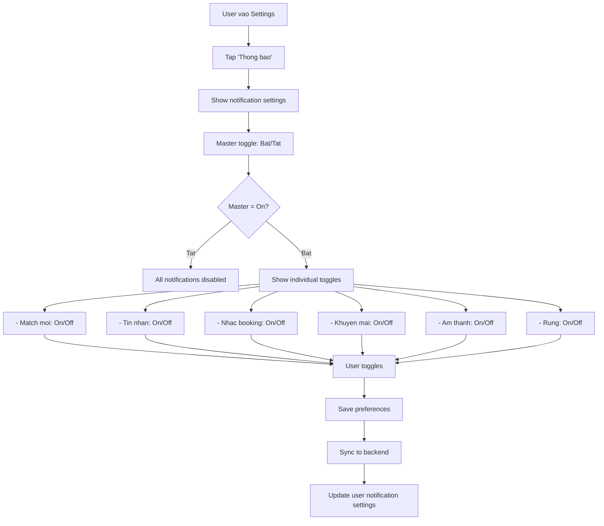
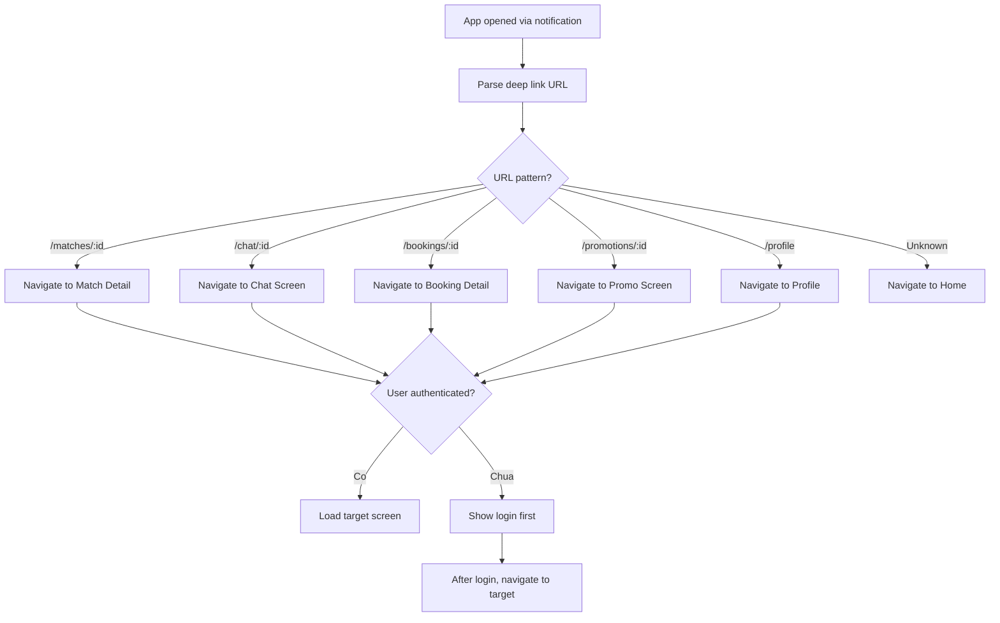
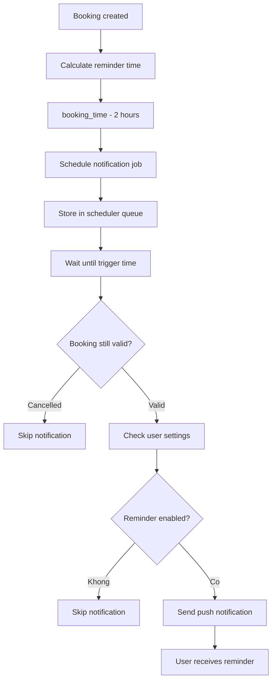

# Activity Diagram: Push Notifications (F08)

## Feature Overview
He thong thong bao day (push notifications) de thong bao nguoi dung ve match moi, tin nhan, nhac lich booking, va cac khuyen mai. Ho tro deep link de dieu huong truc tiep den man hinh lien quan.

## Actors
- **Primary**: User (nhan notification)
- **Secondary**:
  - Push Notification Service (Firebase Cloud Messaging / APNs)
  - Backend Scheduler (scheduled notifications)
  - Admin (promotional notifications)

---

## Main Flow

### Flow 1: Dang Ky Nhan Notification



---

### Flow 2: Nhan Notification - App in Background



---

### Flow 3: Nhan Notification - App in Foreground



---

### Flow 4: Cac Loai Notification

```mermaid
flowchart TD
    A[Notification Types] --> B[NEW_MATCH]
    A --> C[NEW_MESSAGE]
    A --> D[BOOKING_CONFIRMED]
    A --> E[BOOKING_REMINDER]
    A --> F[PROMOTION]

    B --> B1[Trigger: Mutual like]
    B1 --> B2[Title: 'Ban co match moi!']
    B1 --> B3[Body: 'Ten nguoi match']
    B1 --> B4[Deep link: /matches/:id]
    B1 --> B5[Sound: match_sound.mp3]

    C --> C1[Trigger: New message received]
    C1 --> C2[Title: 'Tin nhan tu Ten']
    C1 --> C3[Body: 'Noi dung tin nhan...']
    C1 --> C4[Deep link: /chat/:conversation_id]
    C1 --> C5[Sound: message_sound.mp3]

    D --> D1[Trigger: Booking payment success]
    D1 --> D2[Title: 'Dat san thanh cong']
    D1 --> D3[Body: 'San X - Ngay/gio']
    D1 --> D4[Deep link: /bookings/:id]

    E --> E1[Trigger: 2h before booking]
    E1 --> E2[Title: 'Sap den gio choi']
    E1 --> E3[Body: 'San X luc HH:MM']
    E1 --> E4[Deep link: /bookings/:id]

    F --> F1[Trigger: Admin schedule]
    F1 --> F2[Title: Custom]
    F1 --> F3[Body: Custom]
    F1 --> F4[Deep link: /promotions/:id]
```



---

### Flow 5: Cai Dat Notification



---

### Flow 6: Xu Ly Deep Link



---

### Flow 7: Scheduled Notification (Booking Reminder)



---

## Alternative Flows

### Alt 1: Token Refresh
**Trigger**: FCM token changes
1. Detect token change
2. Update backend with new token
3. Invalidate old token

### Alt 2: Multiple Devices
**Trigger**: User logged in on multiple devices
1. Store multiple tokens per user
2. Send notification to all devices
3. Sync read status across devices

### Alt 3: Notification Grouping
**Trigger**: Multiple messages from same conversation
1. Group notifications by conversation
2. Show count: "3 tin nhan moi tu Ten"
3. Single tap opens chat

---

## Error Handling

### Error 1: Token Registration Failed
- **Trigger**: Network error khi register token
- **System**: Retry on next app open
- **User**: May miss notifications until fixed
- **Logging**: Track for debugging

### Error 2: Push Delivery Failed
- **Trigger**: Invalid token, device offline
- **System**:
  - FCM/APNs reports failure
  - Mark token invalid if permanent
  - Retry for temporary failures
- **User**: May miss notification

### Error 3: Deep Link Invalid
- **Trigger**: Target resource deleted
- **System**: Navigate to fallback (Home)
- **User**: "Noi dung khong con ton tai"

### Error 4: Permission Revoked
- **Trigger**: User turns off in system settings
- **System**: Detect on next app open
- **User**: Show reminder to re-enable

---

## Edge Cases

1. **Notification khi DND mode**: Respect device settings
2. **Multiple rapid notifications**: Collapse/batch
3. **Old notification tapped**: Check if resource still exists
4. **App update changes deep link format**: Handle legacy URLs
5. **User logged out**: Clear token, stop notifications
6. **Timezone change**: Adjust scheduled reminders
7. **Device storage full**: Notification may not show badge
8. **Notification while in target screen**: Suppress, just update

---

## Dependencies

- **Requires**:
  - F01 (Authentication - for user token association)
- **Required by**: None (supporting feature)
- **Integrates with**:
  - F03 (Match notifications)
  - F05 (Message notifications)
  - F07 (Booking reminders)
  - Firebase Cloud Messaging
  - Apple Push Notification service

---

## Data Structure

### Device Token
```typescript
interface DeviceToken {
  id: string;
  user_id: string;
  token: string;
  platform: 'ios' | 'android';
  device_name?: string;
  created_at: DateTime;
  last_used: DateTime;
  is_active: boolean;
}
```

### Notification Payload
```typescript
interface NotificationPayload {
  notification: {
    title: string;
    body: string;
    image?: string;
  };
  data: {
    type: 'NEW_MATCH' | 'NEW_MESSAGE' | 'BOOKING_CONFIRMED' | 'BOOKING_REMINDER' | 'PROMOTION';
    deep_link: string;
    [key: string]: any;
  };
  android?: {
    channel_id: string;
    sound: string;
  };
  apns?: {
    sound: string;
    badge: number;
  };
}
```

### User Notification Settings
```typescript
interface NotificationSettings {
  user_id: string;
  enabled: boolean;
  new_match: boolean;
  new_message: boolean;
  booking_reminder: boolean;
  promotions: boolean;
  sound_enabled: boolean;
  vibration_enabled: boolean;
  updated_at: DateTime;
}
```

### Scheduled Notification
```typescript
interface ScheduledNotification {
  id: string;
  user_id: string;
  type: string;
  payload: NotificationPayload;
  scheduled_at: DateTime;
  status: 'pending' | 'sent' | 'cancelled';
  reference_id?: string; // booking_id, etc.
}
```

---

## Notification Channels (Android)

| Channel ID | Name | Importance |
|------------|------|------------|
| matches | Match moi | High |
| messages | Tin nhan | High |
| bookings | Booking | Default |
| promotions | Khuyen mai | Low |

---

## Sound & Vibration

| Notification Type | Sound | Vibration |
|-------------------|-------|-----------|
| NEW_MATCH | match_sound.mp3 | Long vibrate |
| NEW_MESSAGE | message_sound.mp3 | Short vibrate |
| BOOKING | default | Short vibrate |
| PROMOTION | none | None |

---

## Badge Management

1. **Increment badge** on new notification
2. **Clear badge** when app opened
3. **Partial clear** when specific screen viewed
4. **Sync badge** with backend unread counts

---

## UI/UX Notes

1. **Permission Request**
   - Show benefits before system prompt
   - Explain what notifications they'll get
   - Option to skip and enable later

2. **In-App Banner**
   - Non-intrusive at top
   - Shows sender avatar (messages)
   - Tappable for quick navigation
   - Swipe up to dismiss

3. **Settings Screen**
   - Clear toggle labels
   - Grouped by type
   - Test notification button (dev)

4. **Rich Notifications (iOS)**
   - Expandable with image
   - Quick actions: Reply, View

5. **Notification History (Future)**
   - In-app notification center
   - View past notifications
   - Mark as read

---

## Testing Considerations

1. **Test on both platforms**: iOS and Android behave differently
2. **Test background states**: Killed, background, foreground
3. **Test deep links**: All types, invalid IDs
4. **Test permission flows**: Grant, deny, revoke
5. **Test scheduled notifications**: Timing accuracy
6. **Test batching**: Multiple notifications at once
