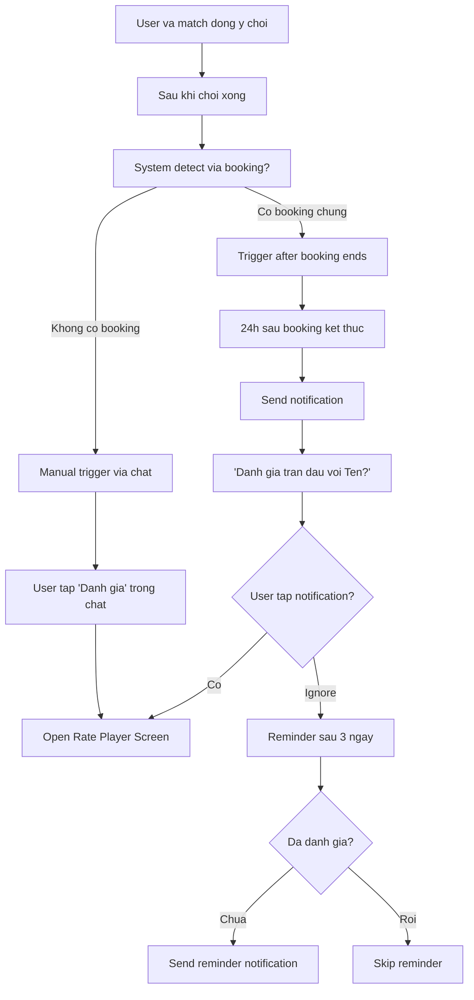
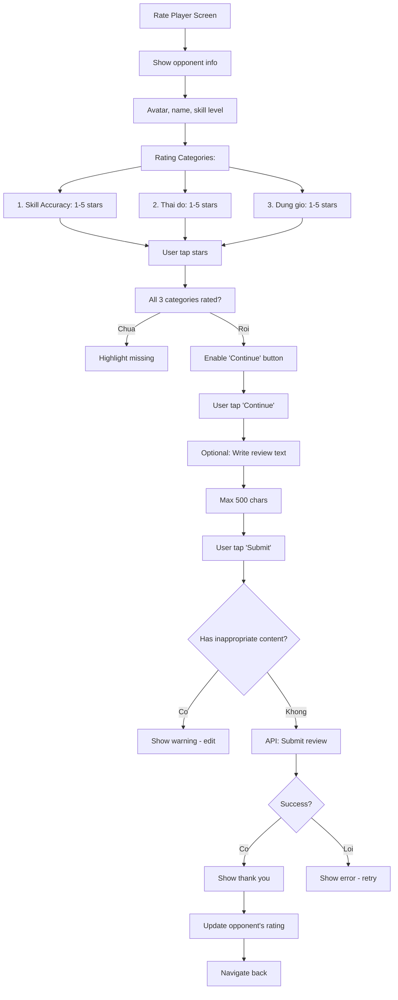
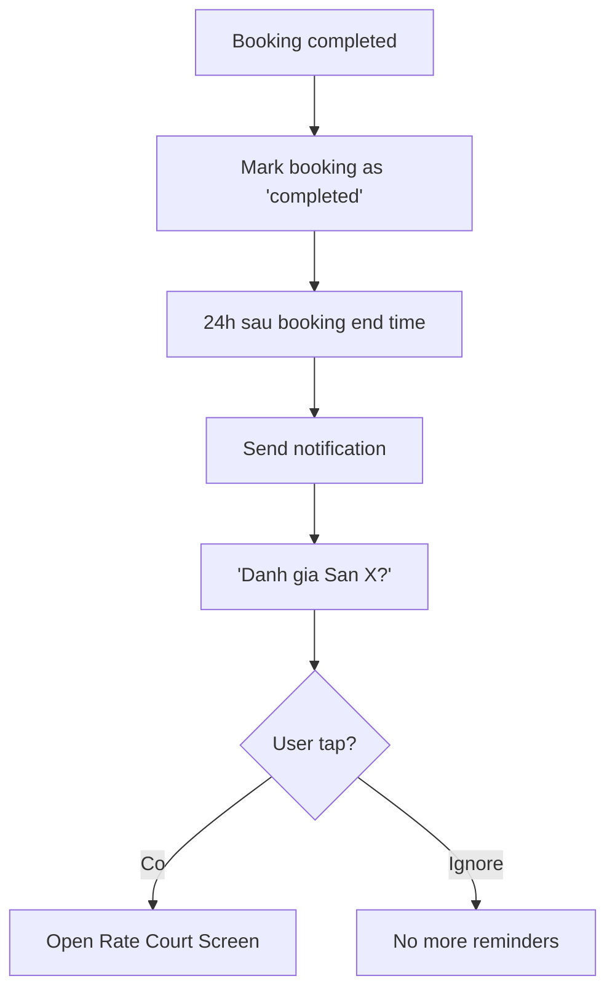
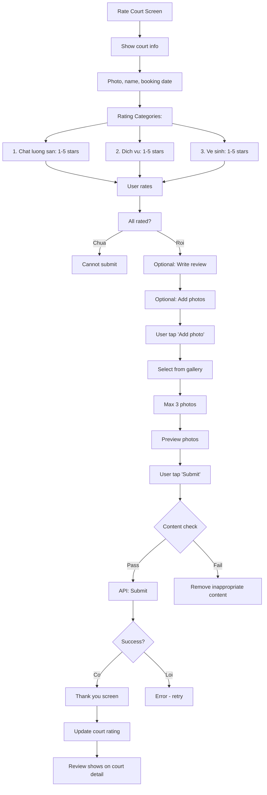
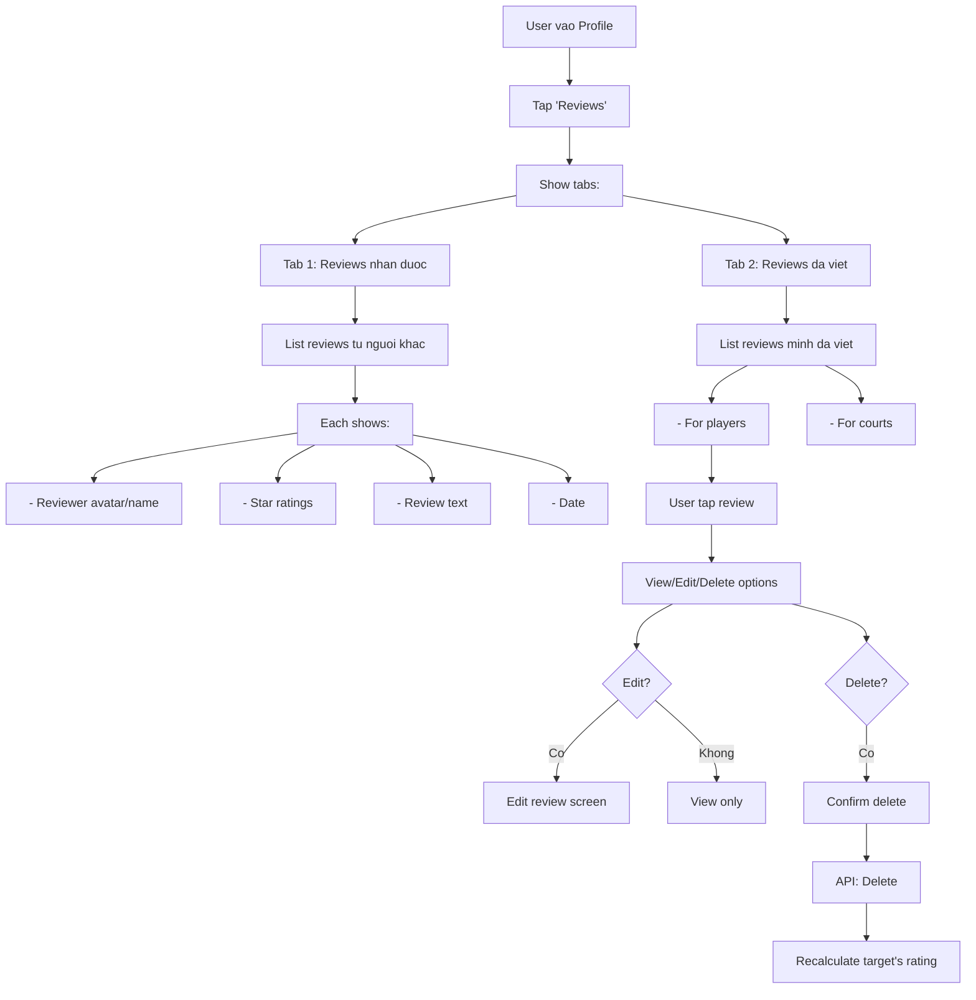
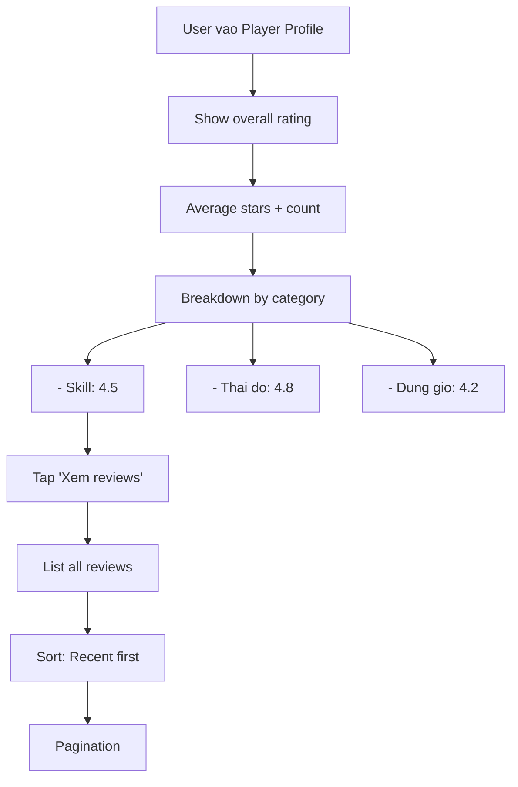

# Activity Diagram: Rating & Review (F09)

## Feature Overview
Cho phep nguoi dung danh gia doi thu sau khi choi (skill, thai do, dung gio) va danh gia san sau khi dat (chat luong, dich vu, ve sinh). Reviews hien thi cong khai de cong dong tham khao.

## Actors
- **Primary**: Authenticated User (da co match hoac booking)
- **Secondary**:
  - Notification Service (nhac danh gia)
  - Moderation System (review moderation)

---

## Main Flow

### Flow 1: Nhac Danh Gia Doi Thu



---

### Flow 2: Danh Gia Doi Thu



**Rating Categories Explained:**
- **Skill Accuracy**: Do chinh xac cua skill level tu khai bao (nguoi do choi dung trinh do khong?)
- **Thai do**: Tinh than the thao, friendly, khong toxic
- **Dung gio**: Co den dung gio hen khong

---

### Flow 3: Nhac Danh Gia San



---

### Flow 4: Danh Gia San



---

### Flow 5: Xem Reviews Cua Minh



---

### Flow 6: Xem Reviews Cua Nguoi Khac



---

## Alternative Flows

### Alt 1: Khong The Danh Gia
**Trigger**: User chua du dieu kien
- Chua match voi nguoi do: "Ban can match truoc"
- Chua co booking tai san do: "Ban can dat san truoc"
- Da danh gia roi: "Ban da danh gia nguoi nay/san nay"

### Alt 2: Edit Review
**Trigger**: User muon sua review
1. Chi edit duoc trong 7 ngay dau
2. Edit comment va photos only (khong edit stars)
3. Mark as "edited" trong UI

### Alt 3: Report Review
**Trigger**: Review vi pham
1. Tap "Report" tren review
2. Select reason
3. Submit to moderation
4. Review bi an tam thoi
5. Admin review va quyet dinh

---

## Error Handling

### Error 1: Submit Failed
- **Trigger**: Network error
- **System**: Save draft locally
- **User**: "Da luu nhap. Thu gui lai"
- **Retry**: Auto-retry khi online

### Error 2: Photo Upload Failed
- **Trigger**: Image too large, network error
- **System**: Show error per image
- **User**: Skip photo hoac retry
- **Note**: Review van submit duoc khong co photo

### Error 3: Inappropriate Content
- **Trigger**: AI detect vulgar language
- **System**:
  - Block submit
  - Highlight problematic text
- **User**: Edit before submit

### Error 4: Target User Deleted
- **Trigger**: Nguoi duoc danh gia xoa account
- **System**: Cannot submit new review
- **User**: "Nguoi dung nay khong con ton tai"
- **Existing reviews**: Van hien thi (anonymized)

---

## Edge Cases

1. **Danh gia chinh minh**: Block trong UI va backend
2. **Multiple bookings same court**: Cho phep nhieu reviews (1 per booking)
3. **Multiple matches same person**: 1 review tong, update duoc
4. **Review sau 30 ngay**: Khong cho phep, qua lau
5. **Court closed after booking**: Van cho phep review
6. **User blocked nhau**: Van thay reviews (public data)
7. **Newly created court**: "Chua co danh gia"
8. **Very few reviews**: Show "it danh gia, co the chua chinh xac"

---

## Dependencies

- **Requires**:
  - F01 (Authentication)
  - F04 (Match Management - review players)
  - F07 (Court Booking - review courts)
- **Required by**: None (end feature)
- **Integrates with**:
  - F02 (Profile - show player reviews)
  - F06 (Court Discovery - show court reviews)
  - F08 (Push Notifications - reminders)

---

## Data Structure

### Player Review
```typescript
interface PlayerReview {
  id: string;
  reviewer_id: string;
  target_user_id: string;
  match_id?: string; // optional link to match
  skill_rating: number; // 1-5
  attitude_rating: number; // 1-5
  punctuality_rating: number; // 1-5
  overall_rating: number; // calculated average
  comment?: string;
  created_at: DateTime;
  updated_at?: DateTime;
  is_edited: boolean;
}
```

### Court Review
```typescript
interface CourtReview {
  id: string;
  reviewer_id: string;
  court_id: string;
  booking_id: string;
  quality_rating: number; // 1-5
  service_rating: number; // 1-5
  cleanliness_rating: number; // 1-5
  overall_rating: number; // calculated
  comment?: string;
  images?: string[];
  created_at: DateTime;
  updated_at?: DateTime;
  is_edited: boolean;
}
```

### User Rating Summary
```typescript
interface UserRatingSummary {
  user_id: string;
  total_reviews: number;
  average_rating: number;
  skill_average: number;
  attitude_average: number;
  punctuality_average: number;
  last_updated: DateTime;
}
```

### Court Rating Summary
```typescript
interface CourtRatingSummary {
  court_id: string;
  total_reviews: number;
  average_rating: number;
  quality_average: number;
  service_average: number;
  cleanliness_average: number;
  last_updated: DateTime;
}
```

---

## Rating Calculation

```typescript
// Player rating
overall = (skill + attitude + punctuality) / 3

// Court rating
overall = (quality + service + cleanliness) / 3

// Aggregate rating
average = sum(all_reviews.overall) / count(all_reviews)
```

**Display Rules:**
- Round to 1 decimal (4.5, 3.7)
- Show count: "4.5 (23 reviews)"
- Min 5 reviews to show average (otherwise "Moi")

---

## Moderation Rules

### Automatic Flags
- Contains profanity
- Contains personal information
- Very short (< 10 chars) with low rating
- Multiple similar reviews (spam)

### Manual Review
- Flagged reviews go to admin queue
- Admin can: Approve, Edit, Delete
- User notified if deleted

---

## UI/UX Notes

1. **Star Rating Input**
   - Large, tappable stars
   - Animation on select
   - Show label: "Tuyet voi", "Tot", "Trung binh", "Kem", "Rat kem"

2. **Category Breakdown**
   - Visual bar chart
   - Color coded (green to red)
   - Easy to compare

3. **Review Card**
   - Reviewer avatar (anonymized option)
   - Star display inline
   - Expandable text if long
   - Date relative ("2 ngay truoc")

4. **Photo Gallery**
   - Thumbnail grid
   - Tap to fullscreen
   - Swipe to navigate

5. **Empty State**
   - "Chua co danh gia nao"
   - Friendly illustration
   - CTA if applicable

6. **Success Animation**
   - Thank you message
   - Stars animation
   - Points earned (gamification - future)
