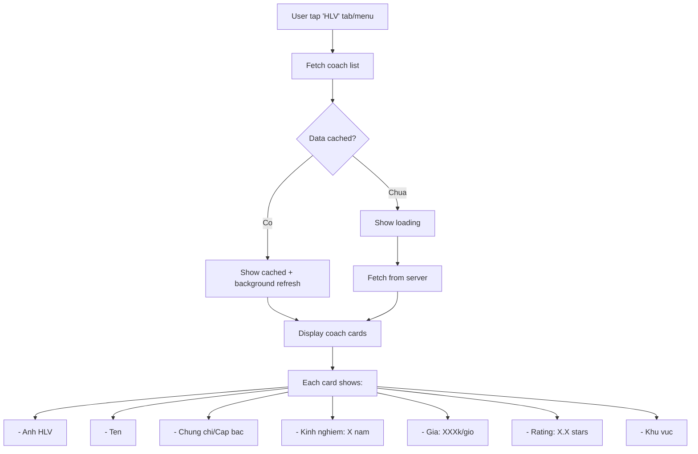
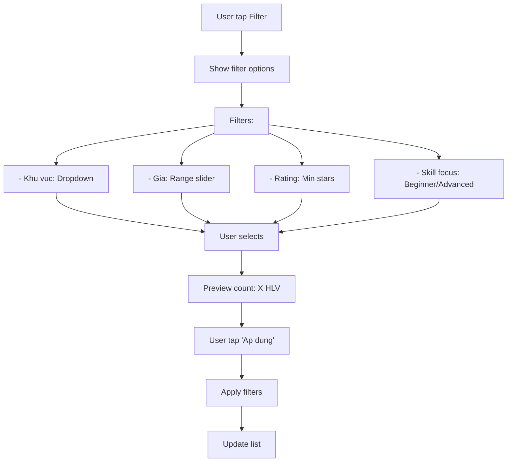
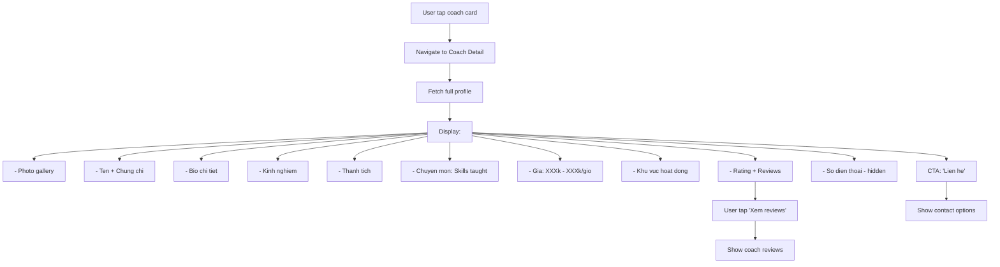
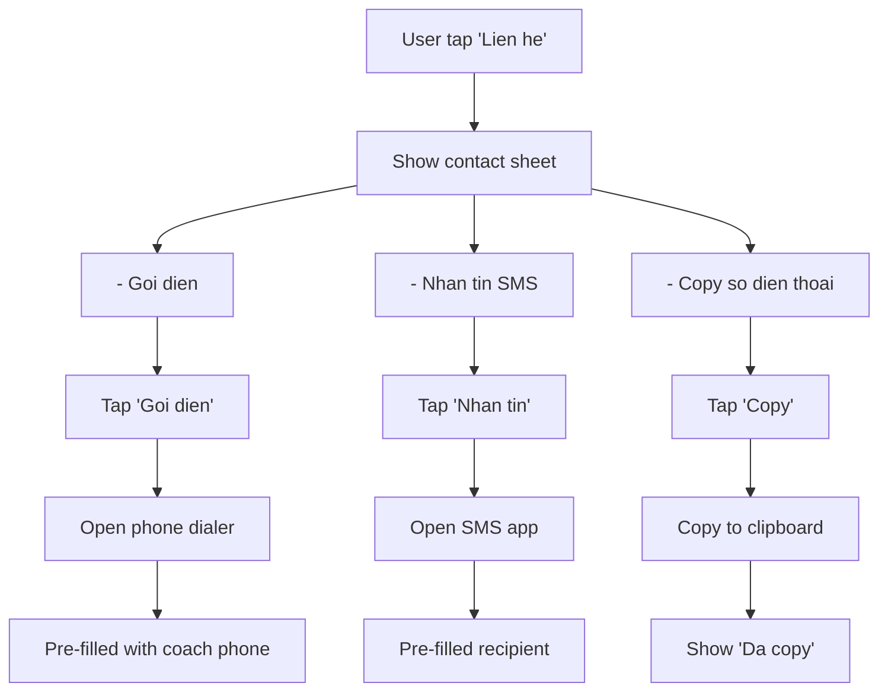
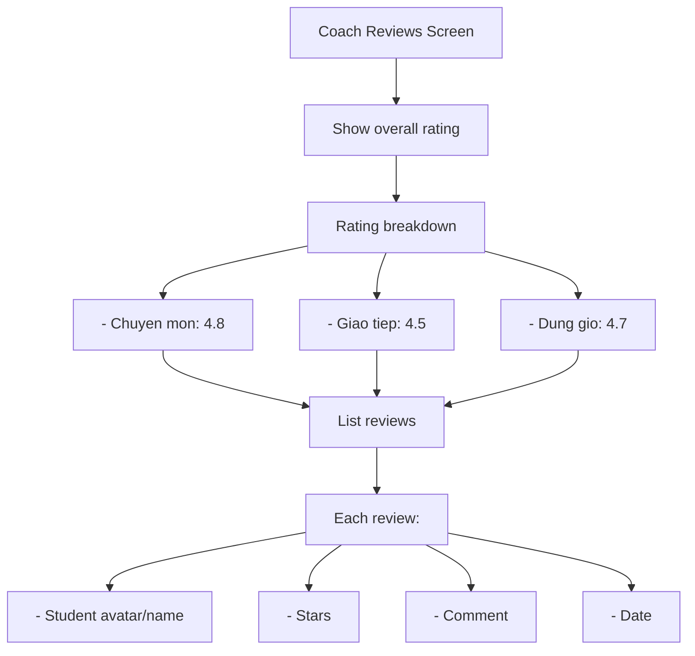

# Activity Diagram: Coach Directory (F10)

## Feature Overview
Hien thi danh sach huan luyen vien (HLV) pickleball voi thong tin co ban de nguoi dung tim va lien he truc tiep. Data duoc quan ly boi admin, khong co booking qua app (MVP scope).

## Actors
- **Primary**: Authenticated User
- **Secondary**:
  - Admin (quan ly data HLV)
  - Phone dialer (call HLV)

---

## Main Flow

### Flow 1: Xem Danh Sach HLV



---

### Flow 2: Filter HLV



---

### Flow 3: Xem Chi Tiet HLV



---

### Flow 4: Lien He HLV



**Note**: Booking/Payment voi HLV nam ngoai scope MVP. User tu lien he va thanh toan truc tiep.

---

### Flow 5: Xem Reviews HLV



**Note (MVP)**: Coach reviews managed by admin. Users cannot submit reviews yet.

---

## Alternative Flows

### Alt 1: No Coaches in Area
**Trigger**: Filter returns empty
1. Show "Chua co HLV trong khu vuc nay"
2. Suggest nearby areas
3. CTA: "Xem tat ca HLV"

### Alt 2: Coach Unavailable
**Trigger**: Coach tam nghi
1. Show "Tam nghi nhan hoc vien"
2. Gray out contact button
3. Show expected return date (neu co)

---

## Error Handling

### Error 1: Load Failed
- **Trigger**: Network error
- **System**: Show cached data (neu co)
- **User**: Pull to refresh
- **Fallback**: Error screen + retry

### Error 2: Phone Call Failed
- **Trigger**: No phone capability (iPad, no SIM)
- **System**: Show "Copy so dien thoai"
- **User**: Copy va goi tu thiet bi khac

### Error 3: Coach Profile Missing
- **Trigger**: Coach removed sau khi cached
- **System**: Show "HLV khong con hoat dong"
- **User**: Navigate back

---

## Edge Cases

1. **No rating yet**: Show "Chua co danh gia"
2. **Multiple locations**: Show list cua coach's areas
3. **Price varies**: Show range "200k - 500k/gio"
4. **Long bio**: Truncate voi "Xem them"
5. **No photos**: Show placeholder
6. **Inactive coach**: Hide tu list, redirect if direct access

---

## Dependencies

- **Requires**:
  - F01 (Authentication)
- **Required by**: None
- **Integrates with**:
  - Phone/SMS native features
  - Admin panel (data management)

---

## Data Structure

### Coach Object
```typescript
interface Coach {
  id: string;
  name: string;
  avatar_url: string;
  images?: string[];
  bio: string;
  certifications: string[];
  experience_years: number;
  achievements?: string[];
  specialties: string[]; // Beginner training, Advanced techniques, etc.
  price_per_hour: number;
  price_range?: { min: number; max: number };
  phone: string;
  areas: string[]; // Quan 1, Quan 7, etc.
  rating: number;
  review_count: number;
  is_active: boolean;
  is_available: boolean; // Accepting new students
  created_at: DateTime;
  updated_at: DateTime;
}
```

### Coach Review (Admin-managed)
```typescript
interface CoachReview {
  id: string;
  coach_id: string;
  reviewer_name: string; // May be anonymous
  expertise_rating: number;
  communication_rating: number;
  punctuality_rating: number;
  overall_rating: number;
  comment: string;
  created_at: DateTime;
}
```

---

## Admin Features (Out of MVP Scope)

Future admin capabilities:
1. Add/Edit/Remove coaches
2. Manage coach reviews
3. Feature/Highlight certain coaches
4. Analytics on coach views and contacts

---

## UI/UX Notes

1. **Coach Card**
   - Horizontal layout
   - Photo prominent
   - Key info at glance
   - Rating visible

2. **Coach Detail**
   - Hero photo/gallery
   - Sticky contact button
   - Collapsible sections
   - Share button

3. **Contact Sheet**
   - Bottom sheet
   - Large tap targets
   - Clear icons

4. **Filter**
   - Simple dropdown/sliders
   - Quick apply
   - Easy reset

5. **Empty State**
   - Friendly message
   - Suggest actions
   - Illustration

6. **Loading**
   - Skeleton cards
   - Pull to refresh indicator
