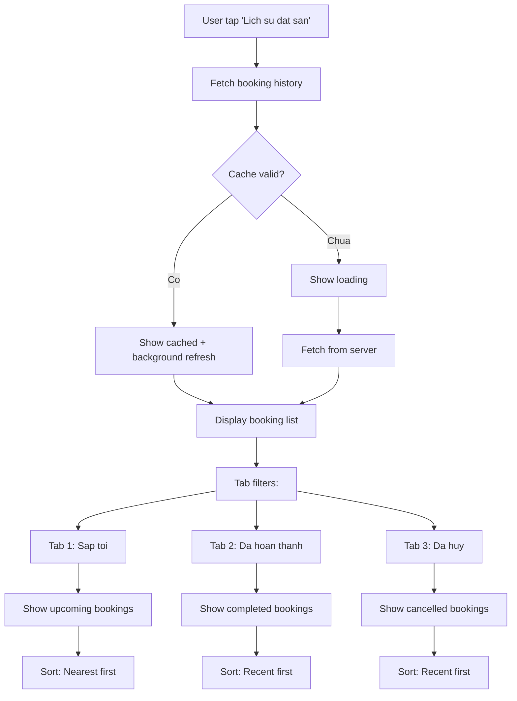
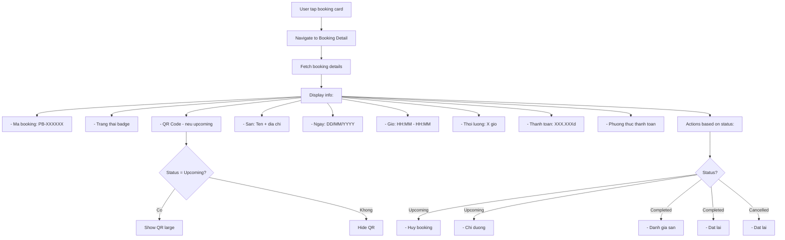
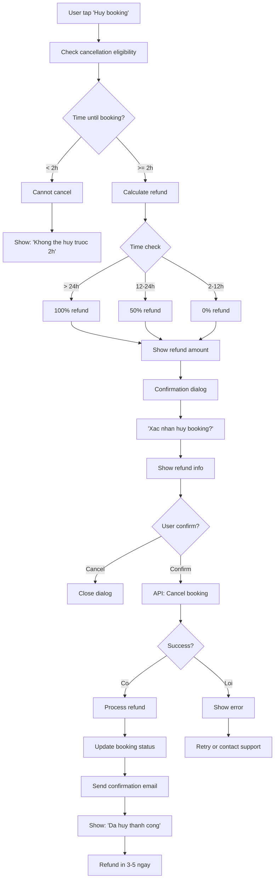
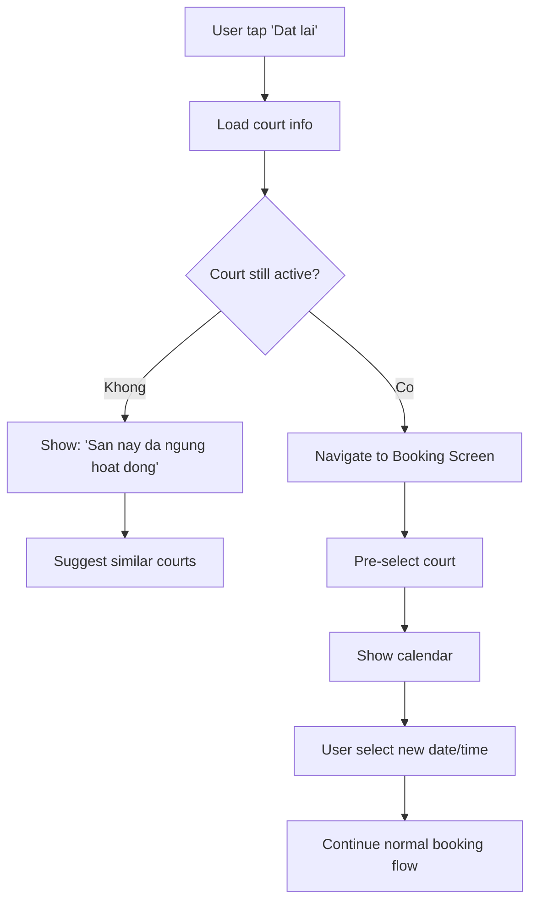
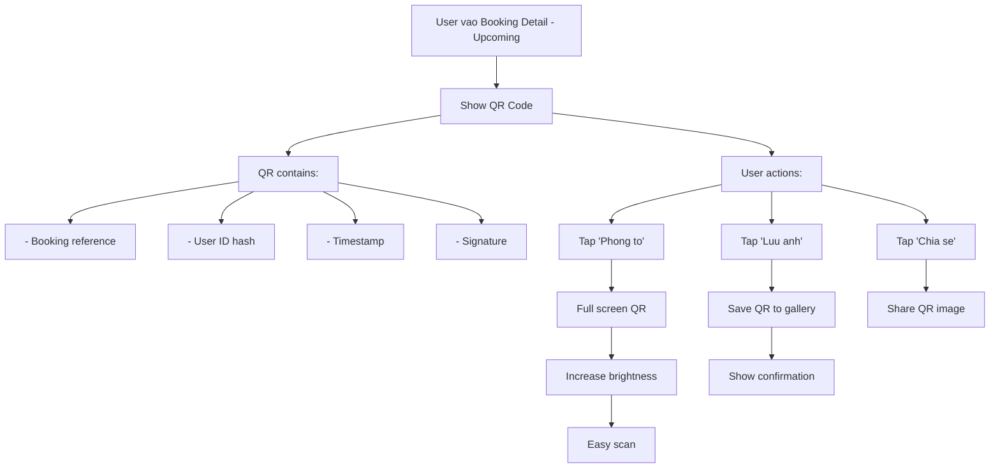
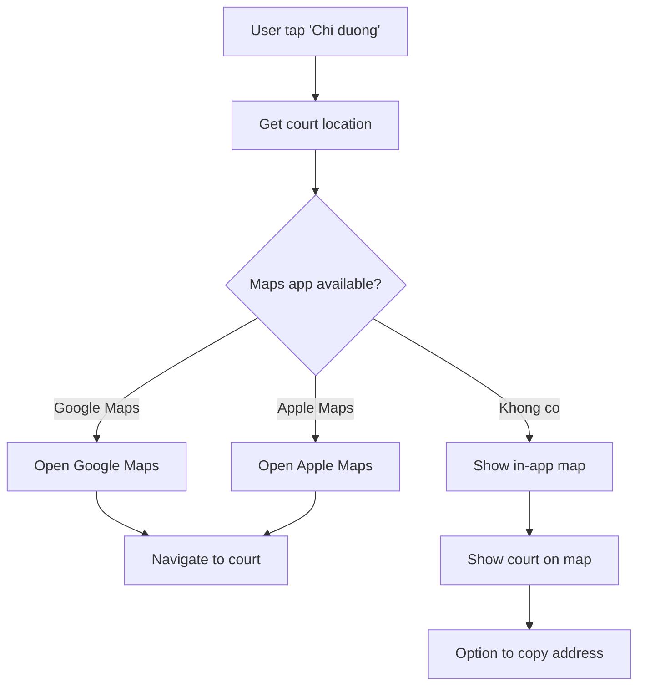
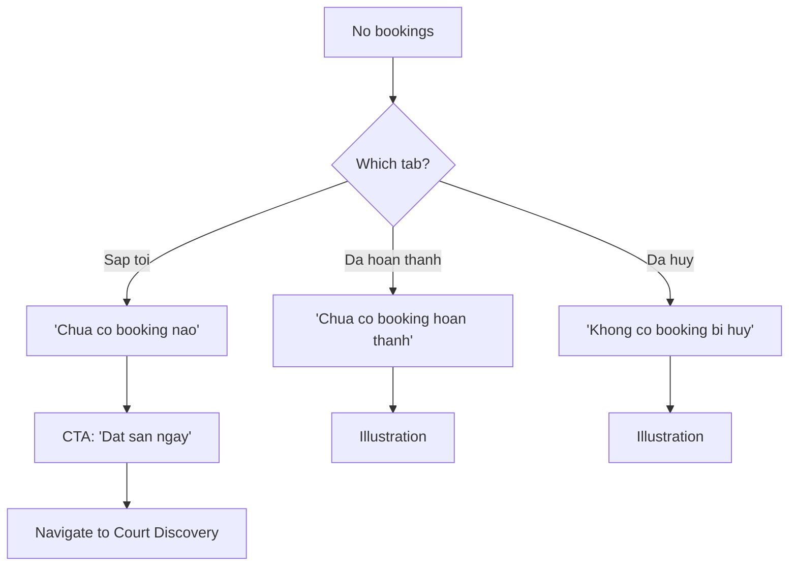

# Activity Diagram: Booking History (F11)

## Feature Overview
Cho phep nguoi dung xem lich su dat san, theo doi trang thai booking, huy booking theo chinh sach, va dat lai tu booking cu.

## Actors
- **Primary**: Authenticated User (da co bookings)
- **Secondary**:
  - Booking System
  - Payment System (refunds)

---

## Main Flow

### Flow 1: Xem Danh Sach Bookings



---

### Flow 2: Xem Chi Tiet Booking



---

### Flow 3: Huy Booking



---

### Flow 4: Dat Lai (Rebook)



---

### Flow 5: Nhan QR Code



---

### Flow 6: Chi Duong Den San



---

### Flow 7: Empty States



---

## Alternative Flows

### Alt 1: Booking About to Start
**Trigger**: < 30 min until booking
1. Show prominent reminder
2. Quick access to QR
3. Directions button prominent
4. Disable cancel (< 2h rule)

### Alt 2: Missed Booking
**Trigger**: User didn't show up
1. Mark as "No show" (by court staff)
2. Show in Completed tab
3. No refund
4. May affect future bookings (policy)

### Alt 3: Court Staff Cancels
**Trigger**: Court cancels booking
1. Notify user immediately
2. Full refund automatically
3. Show "Huy boi san" status
4. Suggest rebooking

---

## Error Handling

### Error 1: Load Failed
- **Trigger**: Network error
- **System**: Show cached bookings
- **User**: Pull to refresh
- **Stale indicator**: "Cap nhat luc X"

### Error 2: Cancel Failed
- **Trigger**: Server error
- **System**: Show error message
- **User**: Retry or contact support
- **Note**: Don't auto-retry (destructive)

### Error 3: Refund Processing Error
- **Trigger**: Payment gateway issue
- **System**:
  - Booking still cancelled
  - Log for manual refund
  - Notify user: "Hoan tien trong 5-7 ngay"
- **User**: Contact support if not received

### Error 4: QR Generation Failed
- **Trigger**: Service error
- **System**:
  - Booking still valid
  - Retry QR generation
  - Show booking reference as backup
- **User**: "Dung ma booking de check-in"

---

## Edge Cases

1. **Multiple bookings same day**: Show all, sort by time
2. **Very old bookings**: Paginate, load on scroll
3. **Booking in progress**: Show "Dang dien ra" badge
4. **Timezone change**: Show in court's timezone
5. **Device change**: QR available on new device (same account)
6. **Screenshot QR**: Still valid (one-time scan at court)
7. **Booking edited by admin**: Show "Da cap nhat" + changes
8. **Price changed after booking**: Honor original price

---

## Dependencies

- **Requires**:
  - F01 (Authentication)
  - F07 (Court Booking - creates bookings)
- **Required by**: None
- **Integrates with**:
  - F06 (Court Discovery - for rebooking)
  - F09 (Rating & Review - rate after completion)
  - Maps apps (directions)
  - Device calendar (export)
  - Photo gallery (save QR)

---

## Data Structure

### Booking Summary (List View)
```typescript
interface BookingSummary {
  id: string;
  reference: string;
  court_name: string;
  court_image: string;
  date: Date;
  start_time: string;
  end_time: string;
  status: BookingStatus;
  total_amount: number;
}
```

### Booking Detail
```typescript
interface BookingDetail {
  id: string;
  reference: string;
  user_id: string;
  court: {
    id: string;
    name: string;
    address: string;
    image: string;
    location: { lat: number; lng: number };
    phone?: string;
  };
  date: Date;
  start_time: string;
  end_time: string;
  duration_hours: number;
  price_per_hour: number;
  discount_code?: string;
  discount_amount: number;
  total_amount: number;
  payment_method: string;
  payment_status: PaymentStatus;
  booking_status: BookingStatus;
  qr_code?: string;
  created_at: DateTime;
  cancelled_at?: DateTime;
  cancellation_reason?: string;
  refund_amount?: number;
  refund_status?: RefundStatus;
}

type BookingStatus = 'confirmed' | 'cancelled' | 'completed' | 'no_show';
type PaymentStatus = 'pending' | 'paid' | 'refunded' | 'partial_refund';
type RefundStatus = 'pending' | 'processed' | 'failed';
```

---

## Cancellation Policy Display

| Condition | Refund | UI Display |
|-----------|--------|------------|
| > 24h before | 100% | "Hoan 100%" - Green |
| 12-24h before | 50% | "Hoan 50%" - Yellow |
| 2-12h before | 0% | "Khong hoan tien" - Red |
| < 2h before | N/A | "Khong the huy" - Disabled |

---

## UI/UX Notes

1. **Tab Design**
   - Pill tabs or underline
   - Badge count for upcoming
   - Swipe between tabs

2. **Booking Card**
   - Court image left
   - Key info right
   - Status badge colored
   - Subtle shadow

3. **QR Code Display**
   - Large, centered
   - White background
   - Zoom button
   - Save/Share options

4. **Status Badges**
   - Confirmed: Blue
   - Completed: Green
   - Cancelled: Red/Gray
   - No show: Orange

5. **Cancel Confirmation**
   - Clear refund info
   - Destructive button red
   - Easy cancel (back out)

6. **Empty States**
   - Friendly illustration
   - Contextual message
   - Action button

7. **Pull to Refresh**
   - Custom animation
   - Last updated time
