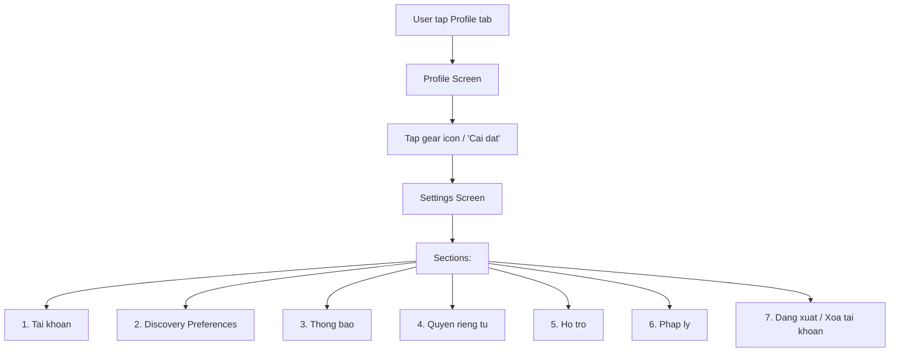
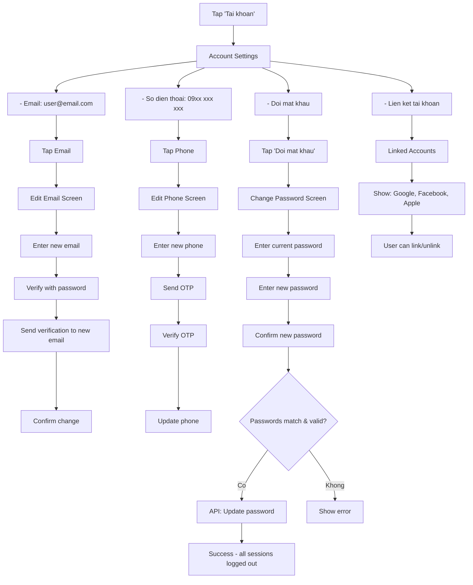
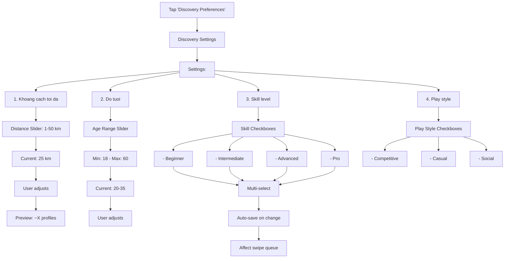
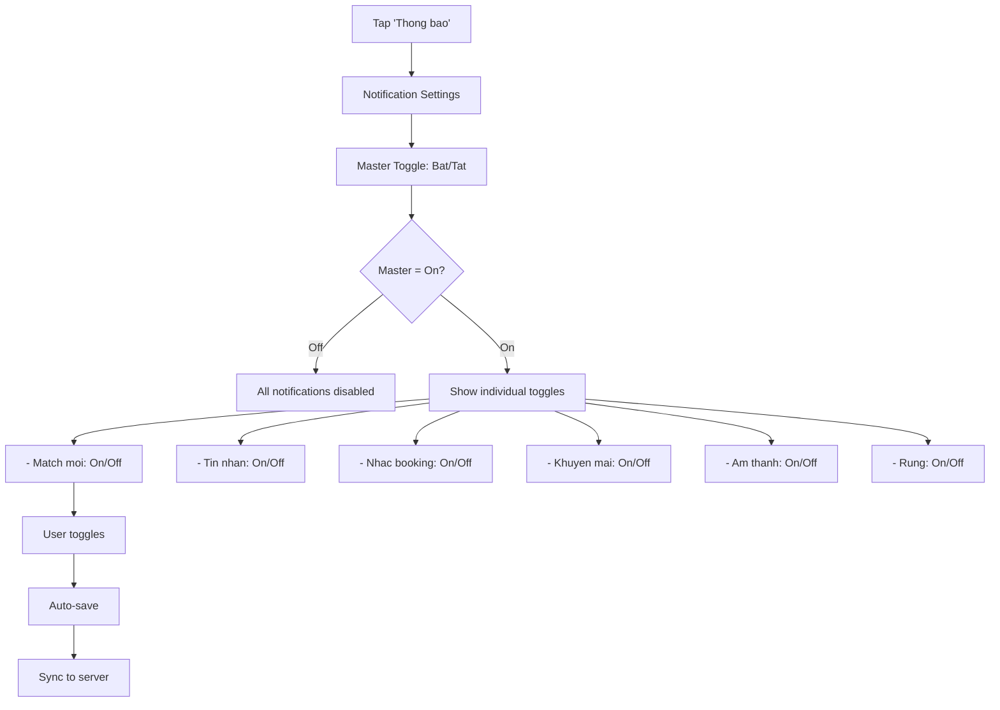
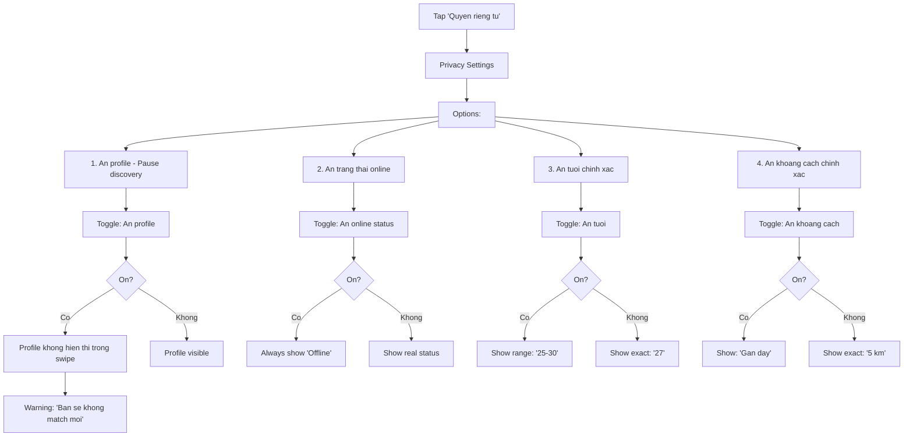
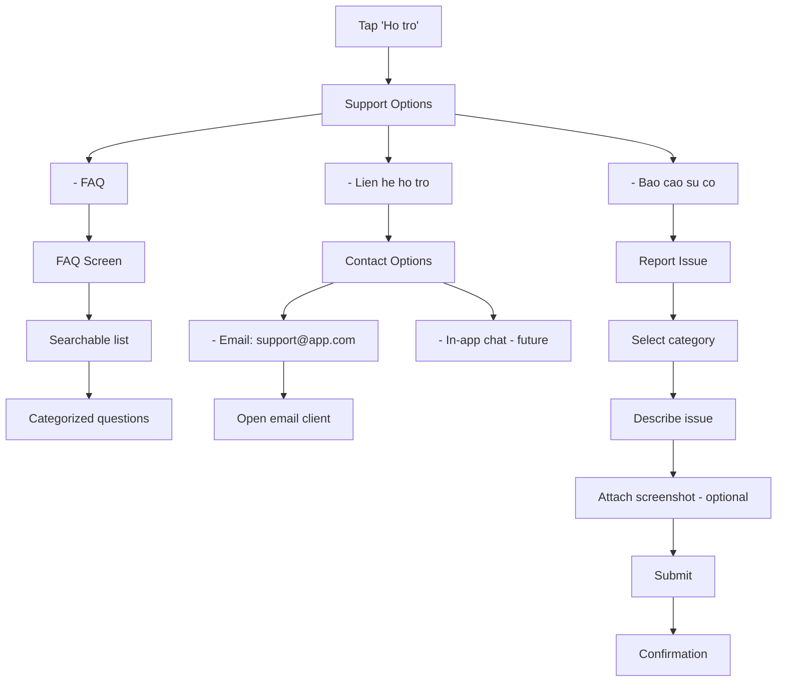
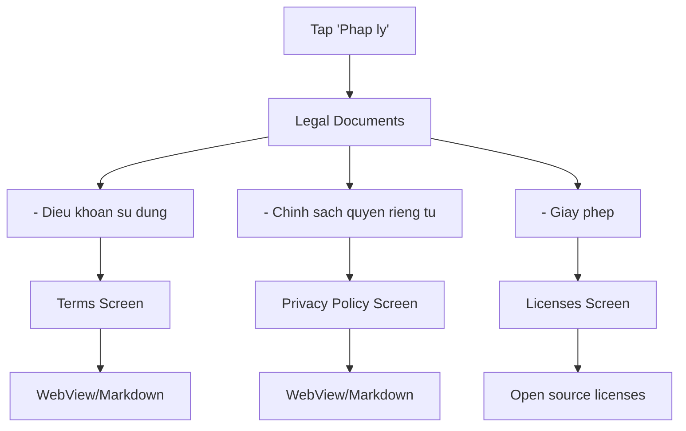
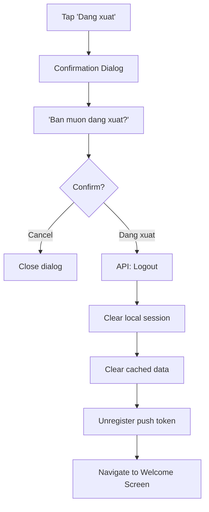
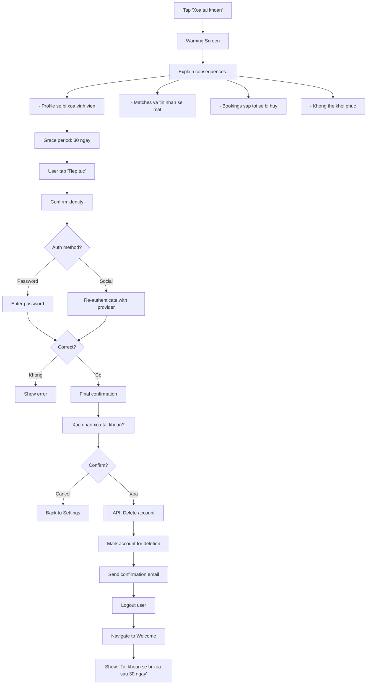

# Activity Diagram: User Settings (F12)

## Feature Overview
Cho phep nguoi dung quan ly tai khoan, cai dat discovery preferences, notifications, privacy, va cac tuy chon khac nhu logout va xoa tai khoan.

## Actors
- **Primary**: Authenticated User
- **Secondary**:
  - Auth System (password, logout, delete)
  - Notification System (preferences)

---

## Main Flow

### Flow 1: Truy Cap Settings



---

### Flow 2: Quan Ly Tai Khoan



---

### Flow 3: Discovery Preferences



---

### Flow 4: Cai Dat Thong Bao



---

### Flow 5: Cai Dat Quyen Rieng Tu



---

### Flow 6: Ho Tro



---

### Flow 7: Phap Ly



---

### Flow 8: Dang Xuat



---

### Flow 9: Xoa Tai Khoan



**Account Deletion Details:**
- 30-day grace period
- User can login within 30 days to cancel deletion
- After 30 days, data permanently deleted
- Active bookings refunded according to policy

---

## Alternative Flows

### Alt 1: Reactivate Account
**Trigger**: User logs in during 30-day deletion period
1. Show "Tai khoan dang cho xoa"
2. Option: "Huy xoa tai khoan"
3. If confirmed, reactivate account
4. All data preserved

### Alt 2: Cannot Change Email (Social Account)
**Trigger**: Account created via Google/Facebook
1. Email tied to social provider
2. Show explanation
3. Option to add password login first

### Alt 3: Forgot Current Password
**Trigger**: User wants to change password but forgot current
1. Link to "Quen mat khau"
2. Reset via email
3. Then can set new password

---

## Error Handling

### Error 1: Update Failed
- **Trigger**: Network error
- **System**: Show error toast
- **User**: Retry
- **Note**: Don't lose form data

### Error 2: Invalid Password
- **Trigger**: Wrong current password
- **System**: "Mat khau hien tai khong dung"
- **User**: Re-enter or reset

### Error 3: Email Already Used
- **Trigger**: New email exists in system
- **System**: "Email nay da duoc su dung"
- **User**: Use different email

### Error 4: Social Unlink Failed
- **Trigger**: Only one login method remaining
- **System**: "Khong the go lien ket - can it nhat 1 phuong thuc dang nhap"
- **User**: Link another method first

### Error 5: Logout Failed
- **Trigger**: Network error during logout
- **System**: Clear local data anyway
- **User**: Token invalidated on next server sync

---

## Edge Cases

1. **Only social login**: Cannot change password (no password set)
2. **Multiple social accounts**: Can unlink all except one
3. **Email = phone login**: Both update together
4. **Settings sync across devices**: Real-time via backend
5. **Old app version**: Show upgrade prompt
6. **Legal document updated**: Show "Updated" badge
7. **Support response**: Via email, no in-app tracking yet

---

## Dependencies

- **Requires**:
  - F01 (Authentication)
- **Required by**: None
- **Integrates with**:
  - F03 (Discovery - preferences affect swipe)
  - F08 (Notifications - settings)
  - F02 (Profile - privacy affects display)

---

## Data Structure

### User Settings
```typescript
interface UserSettings {
  user_id: string;

  // Discovery preferences
  discovery: {
    max_distance_km: number;
    age_range: { min: number; max: number };
    skill_levels: SkillLevel[];
    play_styles: PlayStyle[];
  };

  // Notification preferences
  notifications: {
    enabled: boolean;
    new_match: boolean;
    new_message: boolean;
    booking_reminder: boolean;
    promotions: boolean;
    sound: boolean;
    vibration: boolean;
  };

  // Privacy settings
  privacy: {
    hide_profile: boolean;
    hide_online_status: boolean;
    hide_exact_age: boolean;
    hide_exact_distance: boolean;
  };

  updated_at: DateTime;
}
```

### Account Deletion Request
```typescript
interface AccountDeletionRequest {
  user_id: string;
  requested_at: DateTime;
  scheduled_deletion_at: DateTime; // +30 days
  status: 'pending' | 'cancelled' | 'completed';
  cancelled_at?: DateTime;
}
```

---

## UI/UX Notes

1. **Settings List**
   - Grouped sections
   - Icons for each item
   - Chevron for drill-down
   - Toggle inline for simple settings

2. **Sliders**
   - Show current value
   - Snap to increments
   - Preview count update

3. **Toggles**
   - iOS-style switch
   - Immediate feedback
   - Auto-save

4. **Destructive Actions**
   - Red text/button
   - Confirmation required
   - Clear consequences

5. **Account Deletion**
   - Multi-step process
   - Clear warnings
   - Easy to cancel

6. **Legal Documents**
   - Readable font
   - Scroll indicator
   - Last updated date
